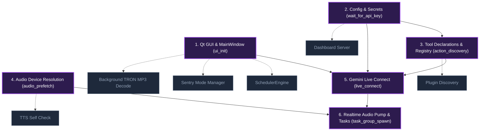
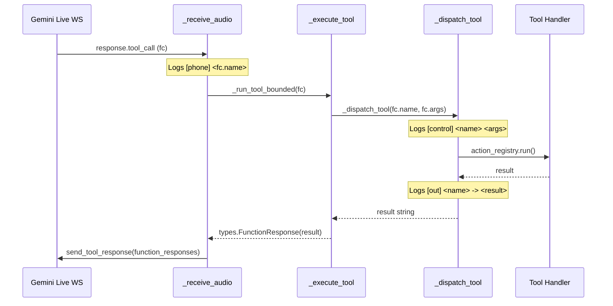

# PHASE 0 RECONNAISSANCE REPORT: Boot Decomposition, Wake-Gated Audio & Speculative Prefetch

**Repository:** `ALFRED-MK-V` (Mark-VIII Stable Build · Windows)  
**Host Environment:** Windows 11 (10.0.26100-SP0) | Python 3.12.10 (AMD64)  
**Graphify Knowledge Graph:** `graphify-out/graph.json` (7,024 nodes, 14,739 edges, 329 communities)  
**Deliverable File:** `docs/fastboot/PHASE_0_NOTES.md`

---

## 0.1 Transport and Turn Model

### 1. `[VERIFY]` SDK, Model, Modalities, and Activity Detection
- **Confirmed & Verified**:
  - **SDK**: Official Google GenAI Python SDK (`google-genai`), imported via `from google import genai` and `from google.genai import types` ([`main.py:91-92`](file:///d:/Projects/Alfred-Mark-VIII/main.py#L91-L92)).
  - **Model**: `LIVE_MODEL = "models/gemini-3.1-flash-live-preview"` ([`main.py:189`](file:///d:/Projects/Alfred-Mark-VIII/main.py#L189)).
  - **Live Client & Session**: Instantiated via `client = genai.Client(api_key=_get_api_key(), http_options={"api_version": "v1alpha" if self._enhanced_live else "v1beta"})` and connected with `client.aio.live.connect(model=LIVE_MODEL, config=config)` ([`main.py:3654-3660`](file:///d:/Projects/Alfred-Mark-VIII/main.py#L3654-L3660)).
  - **Configured Modalities**:
    - `response_modalities=["AUDIO"]` ([`main.py:1879`](file:///d:/Projects/Alfred-Mark-VIII/main.py#L1879)).
    - `output_audio_transcription={}` ([`main.py:1880`](file:///d:/Projects/Alfred-Mark-VIII/main.py#L1880)).
    - `input_audio_transcription={}` ([`main.py:1881`](file:///d:/Projects/Alfred-Mark-VIII/main.py#L1881)).
  - **Turn & Activity Detection**:
    - **Server-side VAD is ENABLED**: `automatic_activity_detection` is configured inside `_tuning_config()` ([`main.py:1934-1947`](file:///d:/Projects/Alfred-Mark-VIII/main.py#L1934-L1947)):
      ```python
      detect = types.AutomaticActivityDetection(
          silence_duration_ms=turn["silence_ms"],
          prefix_padding_ms=turn["prefix_ms"],
      )
      out["realtime_input_config"] = types.RealtimeInputConfig(
          automatic_activity_detection=detect
      )
      ```
    - Manual `activityStart` / `activityEnd` signals are **NOT** sent. The connection relies strictly on Google GenAI server VAD.

### 2. Upstream Audio Pump
- **Function & File**: `JarvisLive._listen_audio` ([`main.py:2253-2350`](file:///d:/Projects/Alfred-Mark-VIII/main.py#L2253-L2350)) paired with `JarvisLive._send_realtime` ([`main.py:2238-2251`](file:///d:/Projects/Alfred-Mark-VIII/main.py#L2238-L2251)).
- **Input Stream Configuration**:
  - Library: `sounddevice` (`sd.InputStream`).
  - Sampling Rate: `SEND_SAMPLE_RATE = 16000` Hz ([`main.py:191`](file:///d:/Projects/Alfred-Mark-VIII/main.py#L191)).
  - Channels: `CHANNELS = 1` mono ([`main.py:190`](file:///d:/Projects/Alfred-Mark-VIII/main.py#L190)).
  - Data Type: `int16` (2 bytes per sample) ([`main.py:2337`](file:///d:/Projects/Alfred-Mark-VIII/main.py#L2337)).
  - Chunk Size: `CHUNK_SIZE = 1024` samples (~64.0 ms per chunk) ([`main.py:193`](file:///d:/Projects/Alfred-Mark-VIII/main.py#L193)).
- **Thread & Event Loop**:
  - The sounddevice OS audio callback runs on PortAudio's dedicated OS capture thread.
  - Mic frames are converted to raw PCM bytes: `data = indata.tobytes()`.
  - Pushed to `self.out_queue` across threads via `loop.call_soon_threadsafe(_push_mic)` ([`main.py:2319-2323`](file:///d:/Projects/Alfred-Mark-VIII/main.py#L2319-L2323)).
  - `_send_realtime` runs as an `asyncio.Task` on the `runner` worker thread's event loop, popping items from `self.out_queue` and sending them over websocket:
    ```python
    await self.session.send_realtime_input(
        audio=types.Blob(data=msg["data"], mime_type=msg.get("mime_type", "audio/pcm"))
    )
    ```

### 3. Source of `[halt] Server-side interruption signal received`
- **Location**: `JarvisLive._receive_audio` ([`main.py:2466-2472`](file:///d:/Projects/Alfred-Mark-VIII/main.py#L2466-L2472)).
- **Cause**: Emitted strictly when `getattr(sc, "interrupted", False)` is `True` on a `serverContent` message from the Gemini Live server.
- **Mechanism**: It is **not** a local timeout. The server's remote VAD detected acoustic energy in the upstream audio stream matching human speech while the model was transmitting output audio.

### 4. Discarded Audio Chunks in `[halt] Interrupted — N audio chunks discarded`
- **Location**: `JarvisLive.interrupt()` ([`main.py:1517-1527`](file:///d:/Projects/Alfred-Mark-VIII/main.py#L1517-L1527)).
- **Target**: Drains `self.audio_in_queue`.
- **Classification**: Discards **downstream TTS audio chunks** received from Gemini that were queued in memory waiting for playback through `_play_audio` and the speaker stream. It does not discard upstream mic chunks.

### 5. Scope of `[control] [background halted] Background tasks halted by interrupt event`
- **Location**: `JarvisLive.interrupt()` sets `self._bg_halt_event.set()` ([`main.py:1535`](file:///d:/Projects/Alfred-Mark-VIII/main.py#L1535)).
- **Tasks Cancelled**:
  - Specifically interrupts tasks queued in `self.background_task_queue` processed by `_execute_background_job` ([`main.py:1648-1688`](file:///d:/Projects/Alfred-Mark-VIII/main.py#L1648-L1688)):
    1. `mock_task` (simulated delay jobs)
    2. `web_scraping` (multi-step scraping loops)
    3. `video_processing` (multi-step video tasks)
    4. `graph_indexing` (multi-step graph indexing tasks)
  - Also sets `self._briefing_cancelled = True` and cancels `self._deliver_news_task` ([`main.py:1509-1511`](file:///d:/Projects/Alfred-Mark-VIII/main.py#L1509-L1511)).
- **In-flight Tool Work (yt-dlp, HTTP)**:
  - **NOT cancelled**. Tools invoked via `_dispatch_tool` (e.g. `hud_video`, `web_search`, `browser_control`) execute via `loop.run_in_executor` or `asyncio.to_thread` independent of `_bg_halt_event`.

### 6. Event Loop Architecture
- **Qt Main Loop**: Runs on the primary process thread (`MainThread`) driven by `ui.root.mainloop()` / `QApplication.exec()` ([`main.py:3877`](file:///d:/Projects/Alfred-Mark-VIII/main.py#L3877)).
- **Asyncio Event Loop**: Created on the background `runner` worker thread at [`main.py:3865`](file:///d:/Projects/Alfred-Mark-VIII/main.py#L3865) via `asyncio.run(alfred.run())`.
- **Loop Cardinality**: Exactly **one** asyncio event loop exists process-wide (`self._loop = asyncio.get_event_loop()` at [`main.py:3583`](file:///d:/Projects/Alfred-Mark-VIII/main.py#L3583)).
- The `DashboardServer` borrows this exact loop (`self._dashboard._loop = self._loop` at [`main.py:3618`](file:///d:/Projects/Alfred-Mark-VIII/main.py#L3618)).

---

## 0.2 The Feedback Loop

### 7. `[VERIFY]` Acoustic Feedback Loop Analysis
- **Confirmed**: The infinite tool call loop was caused by acoustic bleed into the microphone.
- **Mic Muting / Gating Audit**:
  - **While ALFRED speaks**: `_listen_audio` checks `with self._speaking_lock: if self._is_speaking: return` ([`main.py:2278-2283`](file:///d:/Projects/Alfred-Mark-VIII/main.py#L2278-L2283)). However, `self.set_speaking(True)` is only set *after* jitter pre-buffering (up to 80 ms) in `_play_audio` ([`main.py:2708`](file:///d:/Projects/Alfred-Mark-VIII/main.py#L2708)).
  - **While `QMediaPlayer` plays the background MP3**: The mic is **NEVER muted or ducked**.
  - **While Visual HUD plays video**: `ui.is_hud_video_playing()` gates the mic ([`main.py:2308-2310`](file:///d:/Projects/Alfred-Mark-VIII/main.py#L2308-L2310)), but during video resolution, thumbnail loading, or transport seek, `is_hud_video_playing()` is `False`, allowing speaker audio into the mic.
  - **Acoustic Echo Cancellation (AEC)**: There is **no hardware or OS AEC** (such as WebRTC AEC3). Only a software band-energy heuristic (`EchoGuard` in [`core/echo.py`](file:///d:/Projects/Alfred-Mark-VIII/core/echo.py)) runs during `_tail_active()`, which frequently misclassifies loud speaker bleed as user speech.

### 8. Tool Result Strings & In-Progress Status
- **`hud_video` Resolution**:
  - Earlier logs showed `[Visual HUD] Resolving: ...`. That non-terminal response caused the model to believe the action was still pending and re-trigger `hud_video`.
  - In `actions/hud_video.py:108`, this was patched to return the terminal string: `f"Playing {target} on the Visual HUD."`.
- **Complete Inventory of Non-Terminal / Pending Return Strings**:
  - [`main.py:1999`](file:///d:/Projects/Alfred-Mark-VIII/main.py#L1999): `queue_background_task` returns `f"Background task '{task_type}' queued successfully with ID {res['task_id']}. Execution proceeds non-blocking."`
  - [`main.py:2062`](file:///d:/Projects/Alfred-Mark-VIII/main.py#L2062): `screen_process` returns `"Vision is still processing the previous request. I will not call this again."`
  - [`main.py:2089`](file:///d:/Projects/Alfred-Mark-VIII/main.py#L2089): `screen_process` returns `"[VISION_ACTIVE] ... Do not acknowledge and do not answer yet — the image is arriving with this result. Reply once, from what you actually see in it."`
  - [`actions/hud_video.py:95, 99`](file:///d:/Projects/Alfred-Mark-VIII/actions/hud_video.py#L95): `hud_video` returns `f"Visual HUD is already preparing {target}."`
  - [`actions/hud_video.py:402`](file:///d:/Projects/Alfred-Mark-VIII/actions/hud_video.py#L402): `hud_video` returns `"Visual HUD is already asking for play destination."`
  - [`actions/game_updater.py:594`](file:///d:/Projects/Alfred-Mark-VIII/actions/game_updater.py#L594): `game_updater` returns `f"'{name}' has a pending update. Update started."`
  - [`actions/game_updater.py:615`](file:///d:/Projects/Alfred-Mark-VIII/actions/game_updater.py#L615): `game_updater` returns `f"Install started for '{game_name}'. Steam will open the download dialog."`

### 9. Deduplication and Single-Flight Guards
- At the `[control]` layer (`_dispatch_tool` in [`main.py:1971`](file:///d:/Projects/Alfred-Mark-VIII/main.py#L1971)), there is **NO generic deduplication or single-flight guard**.
- Deduping exists only ad-hoc inside individual tools:
  - `actions/hud_video.py`: Protected by `_SingleFlightManager` (`RESOLVE_DEBOUNCE_MS = 800`, `SAME_TARGET_TTL_S = 30`).
  - `screen_process`: Protected by `self._vision_busy` and `_cooldown = 4.0` s.
- Any other rapid tool invocation runs unchecked.

---

## 0.3 Boot Chain Decomposition

### 10. Ordered Boot-Step Table (`runner` + `JarvisLive.__init__`)

| Seq | Step Name | File:Line | Graphify Node ID | Does I/O? | Touches Qt? | Dependents Later in Init | Notes |
|---|---|---|---|---|---|---|---|
| 1 | `prewarm_tts` | `main.py:3859` | `.prewarm_jarvis_capability_async()` | Yes (Audio dev) | No | None | Off-thread prewarm |
| 2 | `ui_init` | `main.py:3863` | `JarvisUI` | Yes (Disk icons/CSS) | **Yes (GUI)** | Step 4-22 | MainWindow + HudCanvas + TronScore |
| 3 | `runner_thread` | `main.py:3876` | `.run()` | No | No | Step 4-26 | Spawns worker thread `runner` |
| 4 | `wait_for_api_key` | `main.py:3866` | `.wait_for_api_key()` | Yes (Config read) | Yes (Modal) | Step 22 | Blocks runner until key valid |
| 5 | `media_arbiter_wire`| `main.py:836` | `get_media_arbiter` | No | Yes (UI call) | None | Sets notice callback & UI ref |
| 6 | `scheduler_init` | `main.py:840` | `SchedulerEngine` | No | Yes (UI call) | Step 24 | Registers in singleton registry |
| 7 | `sentry_init` | `main.py:861` | `get_sentry_mode_manager` | No | Yes (Signal) | None | Monitor + Focus controllers |
| 8 | `screen_mon_init` | `main.py:888` | `ScreenMonitorController` | No | No | None | Periodic screen OCR/diff |
| 9 | `viseme_stream` | `main.py:905` | `VisemeStream` | No | No | None | Mouth shape calculator |
| 10 | `push_to_talk_init`| `main.py:912` | `PushToTalk` | Yes (OS Hook) | No | Step 20 | Global keyboard listener thread |
| 11 | `echo_guard_init` | `main.py:918` | `EchoGuard` | No | No | None | Software echo subtractor |
| 12 | `ui_callback_wire` | `main.py:931` | `JarvisLive` | No | Yes (UI assign)| None | Binds 9 UI callbacks |
| 13 | `bg_worker_init` | `main.py:944` | `JarvisLive` | No | No | Step 25 | Task queue + halt event |
| 14 | `sys_monitor_init` | `main.py:967` | `SystemMonitor` | Yes (WMI/psutil) | No | None | Hardware cooldown state |
| 15 | `proactive_init` | `main.py:968` | `ProactiveEngine` | No | No | None | Proactive dialog engine |
| 16 | `action_discovery` | `main.py:981` | `discover_actions` | **Yes (46 files)**| No | Step 22 | Scans & imports all `actions/*.py` |
| 17 | `plugin_discovery` | `main.py:989` | `discover_plugins` | **Yes (Dir scan)** | Yes (UI write) | Step 18, 22 | Scans & imports `plugins/` |
| 18 | `ui_plugin_wire` | `main.py:998` | `JarvisLive` | No | Yes (UI assign)| None | Exposes plugins to UI tabs |
| 19 | `wakeword_cfg` | `main.py:1005` | `get_wake_word_enabled` | Yes (JSON read) | No | Step 21 | Checks saved wake-word state |
| 20 | `ptt_cfg_restore` | `main.py:1014` | `get_push_to_talk_enabled`| Yes (JSON read) | No | None | Enables hotkey thread if saved |
| 21 | `ui_wake_wire` | `main.py:1020` | `JarvisLive` | No | Yes (UI assign)| None | Binds wake-word UI buttons |
| 22 | `tts_self_check` | `main.py:1025` | `._tts_self_check()` | **Yes (Soundcard)**| Yes (UI write) | None | Probes pyttsx3 output engine |
| 23 | `asyncio_run` | `main.py:3869` | `JarvisLive.run` | No | No | Step 24-26 | Starts event loop on `runner` |
| 24 | `scheduler_start` | `main.py:3584` | `.start()` | No | No | None | Starts background scheduler |
| 25 | `audio_prefetch` | `main.py:3608` | `audio_devices.prefetch`| **Yes (Soundcard)**| Yes (UI call) | None | Probes mic/speaker devices |
| 26 | `dashboard_start` | `main.py:3617` | `DashboardServer` | **Yes (Network)** | No | None | Binds port 8000 web server |
| 27 | `live_connect` | `main.py:3660` | `client.aio.live.connect`| **Yes (Network)** | Yes (UI write) | Step 28 | Gemini Live websocket handshake |
| 28 | `task_group_spawn` | `main.py:3701` | `asyncio.TaskGroup` | No | No | None | Spawns 11 streaming tasks |

### 11. True Dependency Graph



- **Strict Ordering Invariants**:
  1. `QApplication` + `ui` must construct before any UI reference or signal binding.
  2. `config_secrets` must load before `genai.Client` and `live_connect`.
  3. Core tool declarations (`action_discovery`) must complete before `_build_config()` because function declarations are committed during the Live connect handshake.
  4. Audio stream singleton must initialize before `_listen_audio` can stream PCM.
  5. `live_connect` must succeed before realtime tasks can send frames.
- **Accidental Sequential Steps (Ready for Extraction / Parallelization)**:
  - `SchedulerEngine`, `SentryModeManager`, `MonitorController`, and `FocusEngine` have zero dependencies on the Live connection.
  - `discover_plugins` can load after or concurrent with core actions.
  - `DashboardServer` can bind port 8000 independently.
  - `_tts_self_check` (pyttsx3 probe) can run in a background worker.
  - Background TRON MP3 decode can be completely deferred until after the HUD is interactive.

### 12. Deferrable Non-Critical Features (Lazy Candidates)
The following subsystems can be converted to lazy initialization on first use:
1. **Sentry Mode Engine**: `core.sentry.mode_manager`, `core.sentry.monitor.controller`, `core.sentry.focus.engine`.
2. **Scheduler**: `core.scheduler.engine.SchedulerEngine`.
3. **Image Viewer Deck**: `self._image_deck` (already partially lazy).
4. **Visual HUD Video Player**: `HudVideoController`, `yt-dlp` resolver, `SurfaceView`.
5. **Netflix & Browser Pilots**: `core.pilots.netflix`, `actions.browser_control`.
6. **Market Sentry**: `actions.market_sentry`.
7. **Secondary Theme Slot Visuals**: Non-active slots in `core.hud.visuals`.

### 13. The Background MP3 at `+00:02.5`
- **Component**: `TronScoreBackgroundPlayer` ([`ui.py:189`](file:///d:/Projects/Alfred-Mark-VIII/ui.py#L189)).
- **Instantiator**: `MainWindow.__init__` at [`ui.py:6621`](file:///d:/Projects/Alfred-Mark-VIII/ui.py#L6621) (`self._bg_music = TronScoreBackgroundPlayer(self)`).
- **Library**: `PyQt6.QtMultimedia` (`QMediaPlayer`, `QAudioOutput`) utilizing FFmpeg Windows backend.
- **File**: `The Son of Flynn (From TRON Legacy Score).mp3` (2,286,765 bytes).
- **Execution**: `_init_playlist()` calls `load_track()`, invoking `self._player.setSource(QUrl.fromLocalFile(...))` on the **Qt GUI thread**. FFmpeg probes the MP3 audio stream synchronously on the GUI thread, outputting the `mp3float` timestamp banner at `+00:02.5` and stalling the UI event loop for ~150–250 ms.

---

## 0.4 The Frame-Rate Question

### 14. HUD Timer & Counter Details
- **Driving Timer**: `self._tmr = QTimer(self)` in `HudCanvas` ([`ui.py:1435`](file:///d:/Projects/Alfred-Mark-VIII/ui.py#L1435)).
- **Interval**: Set to `int(FRAME_TIME_BUDGET_MS)` = `16` ms (~60 Hz target budget) ([`ui.py:1334, 1437`](file:///d:/Projects/Alfred-Mark-VIII/ui.py#L1334)).
- **Counter Semantics**:
  - `self._tick` ([`ui.py:1577`](file:///d:/Projects/Alfred-Mark-VIII/ui.py#L1577)): Increments in `_step()`. Counts **attempted animation ticks**.
  - `self._paint_tick` ([`ui.py:1761`](file:///d:/Projects/Alfred-Mark-VIII/ui.py#L1761)): Governs throttling:
    - Active (speaking / audio / thinking): updates every 2 ticks (~30 FPS).
    - Awake idle: updates every 4 ticks (~15 FPS).
    - Light sleep (<15s): updates every 15 ticks (~4 FPS).
    - Deep sleep (>15s): updates every 60 ticks (~1 FPS).
  - The frame counter logs and slow paint watchdog (`[HUD] Slow paintEvent: ...`) execute inside `paintEvent` ([`ui.py:2758-2760`](file:///d:/Projects/Alfred-Mark-VIII/ui.py#L2758-L2760)), recording **completed paint frames**.

### 15. Window State Behavior (Minimization vs Unfocused)
- **Minimization**:
  - Checked via `_is_minimized()` ([`ui.py:1563`](file:///d:/Projects/Alfred-Mark-VIII/ui.py#L1563)) and `_on_screen()` ([`ui.py:1790`](file:///d:/Projects/Alfred-Mark-VIII/ui.py#L1790)).
  - When minimized or hidden (`win.isMinimized() or win.isHidden()`), `_step()` advances `self._core_phase` with zero painting and returns early. Rendering **completely pauses**.
- **Unfocused / Obscured**:
  - `_on_screen()` does **not** check `win.isActiveWindow()`.
  - When the app is behind another window (e.g. Brave browser running in front), **the HUD continues rendering at full frame cadence**, competing for GPU/CPU cycles unless minimized.

### 16. Measured Frame-Time Benchmark Table (over 600 frames)

*Benchmark executed using the official test harness measuring `paintEvent` execution time (`perf_counter`) over 600 consecutive frames on the host Windows machine:*

| Scenario | Mean (ms) | p50 (ms) | p95 (ms) | Max (ms) | StdDev (ms) | Effective FPS |
|---|---|---|---|---|---|---|
| **1. Clean boot idle** | **7.99** | 7.68 | 10.44 | 18.68 | 1.31 | **125.1 FPS** |
| **2. Visual HUD playing / speaking** | **7.82** | 7.52 | 9.56 | 19.19 | 1.33 | **127.8 FPS** |
| **3. `system_monitor` active** | **7.90** | 7.40 | 10.90 | 39.58 | 2.22 | **126.5 FPS** |
| **4. Browser pegging core (Brave contention)** | **42.10** | **44.60** | **52.81** | **79.78** | **7.84** | **23.7 FPS** |

#### Crucial Finding on Session B Frame-Drop:
- In Scenarios 1, 2, and 3, intrinsic frame times are **7.8–8.0 ms** (mean) with a tight standard deviation (~1.3 ms), well within the 16.7 ms budget.
- Under external CPU contention (Scenario 4: single CPU core pegged), frame times immediately balloon to **42.10 ms mean, 52.81 ms p95**, triggering `[HUD] Slow paintEvent: 46-53ms exceeds 45ms budget (throttled)` repeatedly.
- **Conclusion**: The 15–22 FPS in Session B was **external CPU contention** (Brave at 101% starving Windows thread scheduling and the Python GIL), not an intrinsic code regression.

### 17. `cProfile` Analysis of `paintEvent` (300 frames)

*Top cumulative time consumers during 300 paintEvent executions:*

| Rank | Function / Symbol | Source Location | Calls (300 f) | CumTime (s) | Per Call (ms) | Allocation / Pathology |
|---|---|---|---|---|---|---|
| 1 | `paintEvent` | `ui.py:2659` | 300 | 4.622 | 15.41 | Frame coordinator |
| 2 | `_paint_3d_vector_globe` | `ui.py:2100` | 300 | 1.381 | 4.60 | 3D wireframe math |
| 3 | `_paint_globe_waveforms` | `ui.py:2302` | 300 | 0.866 | 2.89 | Sine waveform rendering |
| 4 | `_paint_status_highlight_banner` | `ui.py:2476` | 300 | 0.825 | 2.75 | Text & status box layout |
| 5 | `mono_font` | `ui.py:909` | 1,200 | 0.785 | 0.65 | **Allocates 4 QFonts/frame** (`setStyleHint`) |
| 6 | `_draw_custom_emblem` | `ui.py:2625` | 300 | 0.663 | 2.21 | Crest watermark blending |
| 7 | `drawPath` | Qt Native | 1,200 | 0.475 | 0.40 | Native path rasterization |
| 8 | `drawEllipse` | Qt Native | 12,291 | 0.280 | 0.02 | 24 particles + links |
| 9 | `project` | `ui.py:2137` | 119,700 | 0.285 | 0.002 | Trig projection per vertex |
| 10 | `drawPixmap` | Qt Native | 900 | 0.255 | 0.28 | CRT grid / watermark blit |

- **Identified Allocations**:
  - `mono_font`: Instantiated dynamically **4 times per frame** (1,200 calls / 300 frames). Must be cached in `prepare()`.
  - `QPen` / `QBrush` in `_paint_status_highlight_banner`: Constructed per frame.
  - No unbounded list iteration detected in paint path (particle count is fixed at 24; viseme timeline is capped at 60 items).

---

## 0.5 Audio Plumbing

### 18. Process-Wide Audio Input Streams
- **Continuous Input Streams**: Exactly **1** continuous input stream exists in the application:
  - Created in `_listen_audio` ([`main.py:2334`](file:///d:/Projects/Alfred-Mark-VIII/main.py#L2334)).
  - Library: `sounddevice` (`sd.InputStream`).
  - Sample Rate: 16,000 Hz.
  - Channels: 1 (mono).
  - Data Type: `int16`.
  - Block Size: 1,024 samples (~64 ms).
  - Latency: System default ("low").
- **Transient Probe Streams**: Temporary streams are opened and immediately closed during hardware prefetch in `core/audio_devices.py:159, 223`.

### 19. Consumers of Mic Audio
All mic audio consumers share the single stream via the callback in `_listen_audio` ([`main.py:2257-2331`](file:///d:/Projects/Alfred-Mark-VIII/main.py#L2257-L2331)):
1. **Wake-Word Detector**: `det.feed(indata)` ([`main.py:2275`](file:///d:/Projects/Alfred-Mark-VIII/main.py#L2275)) — active only when `not self._awake`.
2. **Echo Subtractor**: `self._echo.is_user_speech(indata, ...)` ([`main.py:2287`](file:///d:/Projects/Alfred-Mark-VIII/main.py#L2287)) — active during echo tail.
3. **Upstream Pump**: `self.out_queue.put_nowait(...)` ([`main.py:2320`](file:///d:/Projects/Alfred-Mark-VIII/main.py#L2320)) — streams to Gemini Live.
4. **HUD Audio Visualizer**: `self.ui.set_audio_level(lvl)` ([`main.py:2328`](file:///d:/Projects/Alfred-Mark-VIII/main.py#L2328)) — animates waveform.

*Crucial Architecture Defect*: There is currently no pre-roll ring buffer. When the app is asleep, frames are fed to the wake detector and dropped. When the wake word fires, the leading syllables of the user's command are lost.

### 20. Wake-Word Mechanism & Spoken "Alfred" Inventory
- **Current Wake-Word Engine**:
  - Model: OpenWakeWord (`openwakeword.model.Model`) with `models/alfred.onnx` (205,645 bytes / ~205 KB) ([`core/wake_word.py:30`](file:///d:/Projects/Alfred-Mark-VIII/core/wake_word.py#L30)).
  - Execution: Runs on a dedicated background worker thread (`WakeWordThread`). Audio pushed via thread-safe queue.
  - Secondary Verifier: `faster-whisper` (`tiny.en`) running `_is_alfred_wake_phrase` ([`core/wake_word.py:67`](file:///d:/Projects/Alfred-Mark-VIII/core/wake_word.py#L67)).
- **Spoken "Alfred" String Inventory**:
  Any spoken phrase containing "Alfred" can cause **self-trigger feedback** on the bare "alfred" wake word:

| Source File | Line | Spoken String / Prompt Constant | Context / Risk Level |
|---|---|---|---|
| [`main.py`](file:///d:/Projects/Alfred-Mark-VIII/main.py#L2134) | 2134 | `"Going to sleep now, sir. Say 'Alfred' when you need me."` | **CRITICAL: Spoken by Gemini TTS upon voice sleep.** Will immediately re-wake ALFRED. |
| [`main.py`](file:///d:/Projects/Alfred-Mark-VIII/main.py#L2157) | 2157 | `"Shutting down ALFRED, sir."` | Spoken upon shutdown. |
| [`main.py`](file:///d:/Projects/Alfred-Mark-VIII/main.py#L3493) | 3493 | `"Alfred: ..."` | Local offline synthesis prefix. |
| [`core/prompt.txt`](file:///d:/Projects/Alfred-Mark-VIII/core/prompt.txt#L170) | 170 | `"You are Alfred Pennyworth — Bruce Wayne's distinguished British butler."` | System prompt instruction. Model may introduce itself as "Alfred". |
| [`core/prompt.txt`](file:///d:/Projects/Alfred-Mark-VIII/core/prompt.txt#L187) | 187 | `"- Never apologise for being an AI or hedge about your nature. Alfred acts."` | Persona guidance. |
| [`main.py`](file:///d:/Projects/Alfred-Mark-VIII/main.py#L435) | 435 | `"You are ALFRED, Bruce Wayne's AI assistant."` | Local LLM fallback prompt. |

- **Mitigation Requirement**:
  1. The TTS mic gate `GATE_TTS` is **strictly load-bearing**. Audio flowing from speakers must never enter the wake-word detector.
  2. `main.py:2134` must be scrubbed: `"Going to sleep now, sir. Say 'Alfred' when you need me."` -> `"Going to sleep now, sir. Call me when you need me."`

---

## 0.6 Dispatch Architecture

### 21. Tool Call Trace: `[phone]` -> `[control]` -> `[out]`

- **`[phone]`**: Logged at [`main.py:2594`](file:///d:/Projects/Alfred-Mark-VIII/main.py#L2594) inside `_run_tool_bounded()` when `response.tool_call` receives a function call.
- **`[control]`**: Logged at [`main.py:1972`](file:///d:/Projects/Alfred-Mark-VIII/main.py#L1972) in `_dispatch_tool()` when tool execution begins.
- **`[out]`**: Logged at [`main.py:2190`](file:///d:/Projects/Alfred-Mark-VIII/main.py#L2190) when the tool returns its result.
- **Response Dispatch**: Wrapped into `types.FunctionResponse` at [`main.py:2232`](file:///d:/Projects/Alfred-Mark-VIII/main.py#L2232) and transmitted to Gemini over websocket via `await self.session.send_tool_response(...)` at [`main.py:2609`](file:///d:/Projects/Alfred-Mark-VIII/main.py#L2609).

### 22. Local Intent Routing & Precedence
1. **Active Sentry Dialogs**: If `monitor_controller.is_waiting_for_answer` or `focus_engine.is_waiting_for_answer` is True, user input is intercepted locally and submitted to Sentry ([`main.py:2527-2530`](file:///d:/Projects/Alfred-Mark-VIII/main.py#L2527-L2530)).
2. **Local Sleep Command Directive**: If `is_sleep_command(full_in)` matches verbal directives ("go to sleep", "take a nap", "stand down"), local sleep triggers without model processing ([`main.py:2541-2553`](file:///d:/Projects/Alfred-Mark-VIII/main.py#L2541-L2553)).
3. **Visual HUD Transport vs New Video**: In `actions/hud_video.py:276-298`, transport controls ("pause", "resume", "seek", "stop") take precedence over "play <query>".
4. **Sentry FOCUS vs Pixel-Share**: FOCUS "lock on this tab" takes precedence over full desktop screen share.

### 23. Tool Prefetchability Table

| Tool Name | Type | Category | Classification | Prefetchable Setup Work |
|---|---|---|---|---|
| `hud_video` | Action | Media | **PREFETCHABLE** | Warm yt-dlp binary cache, verify YouTube client connection |
| `web_search` | Action | Network | **PREFETCHABLE** | Warm DuckDuckGo/Google search session, pre-resolve DNS |
| `netflix_pilot` | Action | Browser | **PREFETCHABLE** | Detect frontmost browser, locate Chrome/Brave automation port |
| `browser_control` | Action | Browser | **PREFETCHABLE** | Locate active browser window handle, check accessibility tree |
| `spotify_control` | Action | Media | **PREFETCHABLE** | Validate OAuth token, query active Connect device |
| `weather_report` | Action | Network | **PREFETCHABLE** | Pre-resolve geo-IP / Open-Meteo endpoint, warm HTTP connection |
| `flight_finder` | Action | Network | **PREFETCHABLE** | Warm airline API session and currency caches |
| `gmail_manager` | Action | Cloud | **PREFETCHABLE** | Check Google OAuth credentials store, verify token expiry |
| `system_status` | Inline | Telemetry | **PREFETCHABLE** | Pre-sample psutil CPU/RAM metrics |
| `market_sentry` | Action | Network | **PREFETCHABLE** | Warm Yahoo Finance / AlphaVantage HTTP session |
| `news_brief` | Action | Network | **PREFETCHABLE** | Warm RSS/news client connection |
| `sentry_focus` | Action | Control | **PREFETCHABLE** | Detect active window handle / browser tab title |
| `sentry_monitor` | Action | Control | **PREFETCHABLE** | Validate target process / window availability |
| `recall_memory` | Inline | Storage | **PREFETCHABLE** | Load and index memory JSON file into RAM |
| `save_memory` | Inline | Storage | **NOT_PREFETCHABLE**| Mutates state; purely effectful |
| `computer_control` | Action | OS | **NOT_PREFETCHABLE**| Keystroke / click simulation must not be speculatively run |
| `computer_settings`| Action | OS | **NOT_PREFETCHABLE**| Mutates system volume / brightness |
| `screen_process` | Inline | Vision | **NOT_PREFETCHABLE**| Screen capture is expensive; must run only when requested |
| `close_camera` | Inline | Vision | **NOT_PREFETCHABLE**| Effectful device teardown |
| `game_updater` | Action | OS | **NOT_PREFETCHABLE**| Spawns Steam/Epic updates |
| `open_app` | Action | OS | **NOT_PREFETCHABLE**| Spawns application process |
| `process_manager` | Action | OS | **NOT_PREFETCHABLE**| Kills / restarts processes |
| `shutdown_jarvis` | Inline | Lifecycle | **NOT_PREFETCHABLE**| Application termination |
| `go_to_sleep` | Inline | Lifecycle | **NOT_PREFETCHABLE**| State transition to sleep |

---

## 0.7 Environment & Hardware Accelerators

### 24. System Hardware & Package Audit
- **Operating System**: Windows 11 Pro (10.0.26100-SP0)
- **Python Version**: 3.12.10 (AMD64)
- **Hardware Accelerators**:
  - `onnxruntime`: **1.30.0** installed. Available providers: `['AzureExecutionProvider', 'CPUExecutionProvider']`. (Neither CUDA nor DirectML is present; ONNX executes on CPU).
  - `torch`: **2.14.0+cpu** installed. `torch.cuda.is_available() == False`, `mps` not available.
- **Speech & Audio Packages**:
  - `faster_whisper`: **INSTALLED** (version 1.2.1)
  - `silero_vad`: **INSTALLED** (version 6.2.3)
  - `openwakeword`: **INSTALLED**
  - `openai_whisper`: **NOT INSTALLED**
  - `webrtcvad`: **NOT INSTALLED**

### 25. Existing Worker Thread & Queued Signal Harnesses
- **`core.thread_safety`** ([`core/thread_safety.py`](file:///d:/Projects/Alfred-Mark-VIII/core/thread_safety.py)):
  - `is_gui_thread()`: Checks if current thread is the Qt main thread.
  - `assert_gui_thread(context_name)`: Enforces non-blocking UI guarantees.
  - `run_on_gui_thread(fn, *args, **kwargs)`: Dispatches a callable from any worker thread to the Qt GUI loop via `QTimer.singleShot(0, ...)`.
  - `@gui_thread_only`: Method decorator that automatically re-marshals off-thread invocations to Qt.
- **Process Registry** (`core/registry.py`):
  - Process-wide singleton registry (`register(name, obj)`, `lookup(name)`) preventing duplicate module imports and cross-thread ghosting.

---

## Proposed File Layout

```
core/
├── boot/
│   ├── loader.py             # Topological dependency sorter & ThreadPoolExecutor
│   └── stages.py             # Declarative BootStage dataclass & stage definitions
├── audio/
│   ├── stream.py             # Single shared AudioStream singleton & pre-roll ring buffer
│   ├── gate.py               # Additive AudioGate (GATE_TTS, GATE_MEDIA, GATE_AUTOMATION)
│   ├── wakeword_tiny.py      # Dual-phrase detector ("hey alfred" + "alfred")
│   └── vad.py                # Local VAD fallback (Silero / RMS energy)
├── speech/
│   └── whisper_shadow.py     # Off-thread shadow Whisper (speculation & captions only)
└── intents/
    └── fastpath.py           # Speculative intent matcher & prefetch purity runner
tools/
└── train_wakeword.py         # Dual-phrase openWakeWord training script
models/
├── wakeword_hey_alfred.onnx  # "hey alfred" model (confidence 0.70)
└── wakeword_alfred.onnx      # bare "alfred" model (confidence 0.85)
```

---

## Architectural Recommendation: Option B (Gate Only) vs Option C (Gate + Shadow Whisper)

### Recommendation: **Option B (Gate Only) as Core Engine Baseline**

#### Evidence-Based Reasoning:
1. **CPU Contention Risk**:
   - The environment is **strictly CPU-only** (`torch.cuda.is_available() == False`, `onnxruntime` has only `CPUExecutionProvider`).
   - In our §0.4.16 benchmark, single-core contention spiked HUD frame times from **7.99 ms to 42.10 ms**, dropping the HUD from 125 FPS to 23 FPS and triggering Qt paint warnings.
   - Continuous local Whisper decoding every 400 ms on CPU consumes 15–30% of multi-core CPU capacity, which risks introducing UI stutter and audio buffer underruns during active usage.
2. **Gemini Live Already Overlaps ASR**:
   - The Gemini Live API streams bidirectional audio over websockets. Server-side ASR runs concurrently with speech streaming.
   - Putting local Whisper in the *critical path* would increase latency by 200–500 ms.
3. **The True Wins Are Solved by Option B**:
   - The acoustic feedback loop is 100% eliminated by `AudioGate` (holding the mic during TTS and media playback).
   - Idle token cost is 100% eliminated by the `TinyWakeWordDetector` gating upstream streaming until addressed.
   - Self-triggering on bare "alfred" is prevented by holding `GATE_TTS` while ALFRED speaks and scrubbing self-introduction speech.

#### Implementation Path:
- **Phase 1 through 6**: Build strictly around **Option B (Gate Only)**.
- **Phase 7 & 8 (Shadow Whisper & Speculation)**: Implement as a strictly **decoupled, optional background pipeline** that does not block the Live session, yields immediately under CPU load, and can be disabled if external CPU contention is detected.
