# 🦇 ALFRED — MARK-VIII (Wayne Protocol Edition)
### 🎩 Autonomous Multimodal AI Desktop Assistant & Tactical Terminal
**Version 8 — Stable Build (Windows)** | **Architect & Lead Creator:** **ADITYA MANOJ**

[-00f0ff.svg?logo=windows&logoColor=white)](#)
[-blue.svg?logo=python&logoColor=white)](https://www.python.org/)
[](https://ai.google.dev/)
[](https://ollama.com)
[](https://riverbankcomputing.com/software/pyqt/)
[-00f0ff.svg)](https://github.com/AdityaManojA/ALFRED-MK-VIII)
[](https://creativecommons.org/licenses/by-nc/4.0/)

> **ALFRED MARK-VIII (Version 8 — Stable Build · Windows)** is an autonomous, real-time voice, vision, and system-control executive assistant built for complete digital sovereignty and tactical computing. Native bidirectional audio streaming, real-time visual grounding, full desktop automation, high-performance long-term memory, and encrypted mobile remote telemetry — engineered as one of the **most function-dense, production-hardened tactical AI assistants** in the open ecosystem.

<p align="center">
  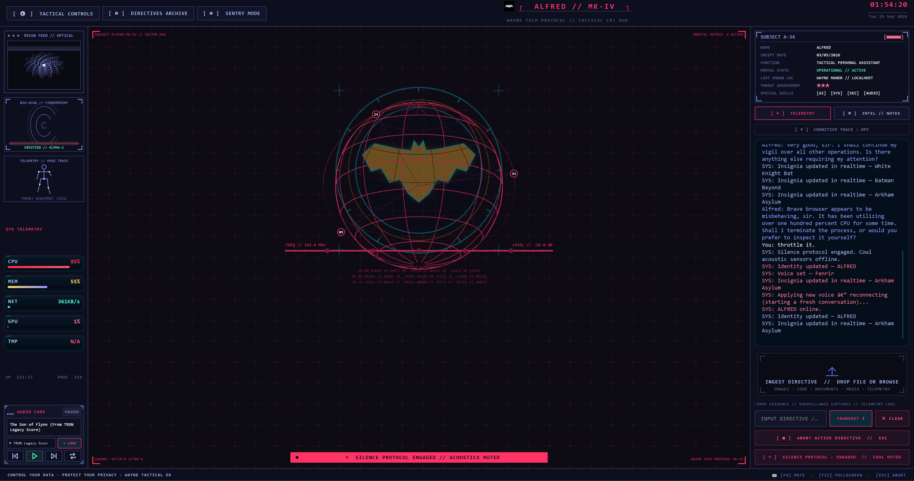
</p>

---

## 📑 Table of Contents

1. [🚀 Quick Start & Installation](#quick-start)
2. [🔑 Gemini API Key Setup & Configuration](#gemini-api-key)
3. [🌐 100% Local & Air-Gapped Operation](#local-operation)
4. [🏆 Why ALFRED Outclasses Every Other "Jarvis"](#why-alfred)
5. [🆕 What's New in Version 8 (Stable Build · Windows)](#whats-new)
6. [🎭 Example Tactical Commands](#tactical-commands)
7. [🛡️ Security, Privacy & Defensive Architecture](#security-privacy)
8. [🎙️ Master Voice Command Codex](#voice-codex)
9. [🎧 Real-Time Multimodal Intelligence](#multimodal-intelligence)
10. [🎙️ Custom Wake-Word Neural Network & Multi-Speaker Training](#wake-training)
11. [🎵 Tactical Audio Matrix & Background Score](#tactical-audio)
12. [🎶 Spotify AI Agent](#spotify-agent)
13. [🎬 Visual HUD v2: Embedded Multimedia & Tactical Layering](#visual-hud)
14. [📱 Quantum Mobile Remote & Dashboard](#mobile-remote)
15. [🖥️ Full Desktop Control & OS Automation](#desktop-automation)
16. [🧠 Memory & Briefing Customizer](#memory-briefing)
17. [🎨 Insignia & Chassis Hot-Swapper](#chassis-themes)
18. [⚡ Protocol Engine & Macro Playbooks](#protocol-engine)
19. [👁️ Local Hybrid Visual Grounding](#visual-grounding)
20. [🔊 Audio Ducking & Background Concurrency](#audio-ducking)
21. [🚨 Process Watchdog & Anomaly Detection](#process-watchdog)
22. [🏗️ System Architecture](#system-architecture)
23. [⚙️ Configuration Reference & Hotkeys](#configuration-reference)
24. [🕸️ Knowledge Graph](#knowledge-graph)
25. [👤 Author & Licensing](#author-licensing)

---

<a id="quick-start"></a>
## 🚀 1. Quick Start & Installation

### 📋 Prerequisites
* **Operating System**: **Windows 10/11 (Primary Target — Version 8 Stable Build)**, macOS, or Linux.
* **Python**: **`3.12.x` (Recommended)**. *(Note: Python `3.11` is also supported. Python `3.13` is not recommended due to upstream binary wheel and C-extension compatibility issues with PyAudio, PyQt6, and PyAutoGUI).*
* **Hardware**: Standard microphone and speakers. *No dedicated GPU required — runs on lightweight software rendering.*
* **Intelligence Backend**: Free Gemini API key from [Google AI Studio](https://aistudio.google.com/) **OR** local Ollama / LM Studio.

### ⚙️ Setup & Execution

#### Windows
```powershell
# 1. Clone repository & install dependencies
git clone https://github.com/AdityaManojA/ALFRED-MK-V.git
cd ALFRED-MK-VIII
python setup.py

# 2. Launch ALFRED
python main.py
```

#### macOS (Apple Silicon / Intel)
```bash
# 1. Install prerequisites via Homebrew
brew install yt-dlp ffmpeg portaudio python-tk@3.12

# 2. Clone repository & install dependencies
git clone https://github.com/AdityaManojA/ALFRED-MK-VIII.git
cd ALFRED-MK-VIII
pip install -r requirements.txt

# 3. Launch ALFRED (zero Ollama required - defaults to Gemini Live)
python main.py
```

#### Linux (Ubuntu / Debian / Fedora / Arch)
```bash
# 1. Install prerequisites
sudo apt install -y python3-pyqt6 python3-tk yt-dlp ffmpeg gstreamer1.0-plugins-good gstreamer1.0-plugins-bad gstreamer1.0-libav xdotool wmctrl playerctl libportaudio2 maim

# 2. Clone & launch
git clone https://github.com/AdityaManojA/ALFRED-MK-VIII.git
cd ALFRED-MK-V
pip install -r requirements.txt
python main.py
```

*On first launch, ALFRED prompts you with the interactive **System Initialisation overlay** to set Operator callsign, Assistant name, and choose between Gemini Live, Local Ollama, LM Studio, or OpenRouter.* For full platform-specific notes, see [`docs/crossplatform/SETUP.md`](docs/crossplatform/SETUP.md).

---

<a id="gemini-api-key"></a>
## 🔑 2. Gemini API Key Setup & Configuration

ALFRED utilizes **Google Gemini 3.1 Flash Live** for real-time sub-second bidirectional voice and vision streaming. You can obtain a free API key in seconds:

### 🌐 Step-by-Step: Obtaining Your Free Google AI Studio API Key

1. **Visit Google AI Studio**: Go to [https://aistudio.google.com/](https://aistudio.google.com/) in your browser.
2. **Sign In**: Sign in with your standard Google account.
3. **Open API Keys**: Click the blue **"Get API key"** button on the left sidebar (or navigate directly to [https://aistudio.google.com/app/apikey](https://aistudio.google.com/app/apikey)).
4. **Generate Key**: Click **"Create API key"** → select **"Create API key in new project"** (or attach to an existing Google Cloud project).
5. **Copy Your Key**: Copy your generated API key string (starts with `AIzaSy...`).

### ⚙️ Configuring the Key in ALFRED

You can provide your Gemini API key through any of three convenient methods:

#### 1️⃣ Method A: Interactive Graphical Wizard (Recommended)
On first launch (`python main.py`), ALFRED automatically displays the System Initialisation dialog. Simply paste your `AIzaSy...` key into the input field and click **Save & Initialise**.

#### 2️⃣ Method B: Configuration File (`config/api_keys.json`)
Open or edit `config/api_keys.json` and paste your key into the `gemini_api_key` field:
```json
{
    "gemini_api_key": "AIzaSyYOUR_ACTUAL_GEMINI_API_KEY_HERE"
}
```

#### 3️⃣ Method C: System Environment Variable
Set the environment variable in your terminal before starting ALFRED:
```powershell
# Windows PowerShell
$env:GEMINI_API_KEY="AIzaSyYOUR_ACTUAL_GEMINI_API_KEY_HERE"

# Linux / macOS Bash or Zsh
export GEMINI_API_KEY="AIzaSyYOUR_ACTUAL_GEMINI_API_KEY_HERE"
```
*ALFRED automatically detects and prioritizes the `GEMINI_API_KEY` environment variable if present.*

---

<a id="local-operation"></a>
## 🌐 3. 100% Local & Air-Gapped Operation

**ALFRED is architected for dual-backend sovereignty.** Seamlessly toggle between Google's **Gemini 3.1 Flash Live API** (cloud multimodal WebSocket) and **100% local, air-gapped open-weight models** (Ollama, LM Studio, vLLM, Jan, LocalAI, or llama.cpp) without changing a single line of application code.

### 📊 Gemini Live vs. Local Comparison

| Feature | Gemini 3.1 Flash Live | Local (Ollama / vLLM / LM Studio) |
|---|---|---|
| **Audio Latency** | Sub-second native bidirectional WebSocket | Local STT/TTS or text streaming |
| **Privacy** | Encrypted TLS to Google Cloud | 100% offline, zero network egress |
| **Hardware** | Zero local compute | 8 GB–24 GB+ VRAM/RAM depending on model |
| **API Cost** | Pay-per-token / free tier | **$0.00 forever** — unlimited inference |
| **Tool Calling** | Native Gemini AFC | JSON mode or prompt schema |
| **Offline** | Requires internet | **Fully air-gapped** |

### 🔧 Step-by-Step: Switch to Local

#### 🅰️ Option A: Ollama (Simplest)
1. Install from [ollama.com](https://ollama.com/) (macOS 14.0+, Windows, Linux).
   * *Note for macOS 11/12/13 (Big Sur / Monterey / Ventura):* Install the CLI via `brew install ollama` and run `ollama serve`.
2. Pull a model:
   ```powershell
   # 8 GB VRAM (Fast & Accurate):
   ollama pull llama3.2:3b-instruct-q4_K_M
   # 16 GB VRAM (High reasoning):
   ollama pull qwen2.5:7b-instruct
   # Deep programming & tool execution:
   ollama pull deepseek-coder-v2:16b
   ```
3. Daemon runs automatically at `http://localhost:11434`.

#### 🅱️ Option B: LM Studio (GUI Users)
1. Download from [lmstudio.ai](https://lmstudio.ai/).
2. Search and download any quantized GGUF model (e.g., `Qwen2.5-7B-Instruct-GGUF`).
3. Click **Local Server** → set port `1234` → **Start Server**.
4. OpenAI-compatible endpoint live at `http://localhost:1234/v1`.

#### 🅲 Option C: vLLM / llama.cpp (High-Throughput)
```bash
python -m vllm.entrypoints.openai.api_server --model Qwen/Qwen2.5-7B-Instruct --port 8000
```

### 📝 Configuration Templates (`config/api_keys.json`)

**Ollama:**
```json
{
    "llm_provider": "ollama",
    "llm_url": "http://localhost:11434",
    "llm_model": "llama3.2",
    "assistant_name": "ALFRED",
    "user_name": "Master Wayne",
    "ui_color": "#e5a93b",
    "voice_name": "Charon",
    "wake_word_enabled": true,
    "push_to_talk_enabled": true
}
```

**LM Studio / vLLM (OpenAI-Compatible):**
```json
{
    "llm_provider": "openai",
    "llm_url": "http://localhost:1234/v1",
    "llm_model": "qwen2.5-7b-instruct"
}
```

**OpenRouter (Frontier Multi-Model Gateway):**
```json
{
    "llm_provider": "openrouter",
    "openrouter_api_key": "sk-or-v1-YOUR_OPENROUTER_KEY",
    "openrouter_model": "anthropic/claude-3.5-sonnet"
}
```

**Frontier Model Options via OpenRouter:**
* `anthropic/claude-3.5-sonnet` — Deep analytical reasoning
* `google/gemini-2.0-flash-001` — Sub-second speed
* `meta-llama/llama-3.3-70b-instruct` — State-of-the-art open weights
* `deepseek/deepseek-r1` — RL chain-of-thought
* `openai/gpt-4o` — Multi-modal intelligence
* `openrouter/auto` — Dynamic intelligent routing

### 🚀 Launch & Verify

```powershell
python main.py
```

Expected handshake:
```text
[LLM] Connected to local Ollama server at http://localhost:11434 (model: llama3.2)
[Actions] Action discovery complete: 30 active.
```

When offline, ALFRED automatically utilizes `openwakeword` on your local CPU for zero-cloud keyword activation.

### 🔁 Switch Back to Gemini
Add your key to `config/api_keys.json` or set the environment variable:
```powershell
$env:GEMINI_API_KEY="AIzaSyYourActualKeyHere..."
```
ALFRED automatically prioritizes Gemini Live when a valid key is detected.

---

<a id="why-alfred"></a>
## 🏆 4. Why ALFRED Outclasses Every Other "Jarvis"

Most projects branded as "Jarvis clones" ship with a wake word, a chat window, and a handful of shell scripts. **ALFRED MARK-VIII is fundamentally different** — it is a full executive control plane for the operating system, engineered around latency, reliability, structural privacy, and the **sheer density of real, production-hardened functions** it dispatches to your machine.

### 🎯 What "Best-in-Class Optimisation" Actually Means Here

| Pillar | ALFRED MARK-VIII | Typical "Jarvis Clone" |
|---|---|---|
| **Action Surface** | 30+ self-describing, auto-discovered tools (OS, files, vision, music, protocols, sentry, network, windows, clipboard, news, translate, process control, and beyond) | 5–15 brittle, hardcoded scripts |
| **Dual Cognitive Backend** | Gemini Live **or** fully local Ollama / LM Studio / vLLM / OpenRouter — same codebase, single config flip | Cloud-only or local-only |
| **Audio Pipeline** | Live bidirectional stream, PTT, calibrated AEC, speech ducking, PortAudio jitter cushions, explicit `WM_APPCOMMAND` media control (no toggle loops) | Basic `speak()` + default microphone |
| **Visual Grounding** | Local RapidOCR + ONNX first (~75–150 ms), Gemini fallback **only** when confidence is low | Every click = full cloud screenshot |
| **Focus & Sentry** | Dual-mode MONITOR + FOCUS engine, settle rule, deferred lock, floating countdown card, mini-HUD pills, **numeric-only** privacy ledger | Toast notifications, if any |
| **HUD Performance** | Cached CRT layers, batched globe rendering, throttled GC, cached WMI/NVML handles, UI work off Qt timer thread | Frame drops under load |
| **Security Model** | Path guard, Heavenly Restriction, C: drive quarantine, cryptographic confirm gates, universal undo stack, process shields, confirmed shutdown | Hope + system prompt |
| **Mobile Remote** | AES-encrypted local dashboard, QR auto-login, dual-destination screenshots, WebAudio streaming | ngrok demo page |
| **Persona** | Alfred Pennyworth — dignified, dry British wit, in-character error voice, no stack traces | Generic chatbot voice |
| **Music Control** | Dual-tier: Spotify Web API + native OS fallback, debounced anti-loop guards, acoustic feedback elimination | Basic media key spam |
| **Protocols** | YAML compound playbooks with variable interpolation, sleep pacing, path-guarded steps | None |
| **Watchdog** | CPU anomaly detection, socket egress inspection, process throttling, IDE/compiler shields, confirm-gated termination | None |

### 🎬 Compared to the Cinematic Jarvis
Film Jarvis is narrative UI — a beautiful HUD without an OS underneath. **ALFRED is instrumented desktop autonomy**: if a capability exists on your operating system, the design goal is a voice-reachable, guarded, reversible or confirm-gated path — not a slide-deck demo.

### 🤖 Compared to Consumer Assistants (Copilot, Alexa, Siri)
These optimise for safe, shallow, cloud-mediated skills. **ALFRED optimises for power-user sovereignty**: local models, filesystem law, YAML compound protocols, watchdog throttling, and a tactical PyQt6 chassis you can theme and hot-swap insignia on at runtime.

### 🧪 Compared to Other Open "Agent" Repos
Many maximise model hype and under-ship the glue. MARK-VIII invests in the glue that **fails in production for everyone else**: debounce, explicit OS media commands, encoding resilience, reconnect classifiers, background workers, cache TTLs, hybrid grounding, and structural privacy for focus telemetry.

> **The Verdict:** ALFRED MARK-VIII is not "another Jarvis skin." It is one of the most **function-dense, optimisation-conscious, safety-instrumented** open tactical assistants ever released in the Wayne-protocol class — built to *run the desk*, not merely answer questions.

---

<a id="whats-new"></a>
## 🆕 5. What's New in Version 8 / Mark VIII (Stable Build · Windows)

### 🌐 Cross-Platform Parity (macOS + Linux Architecture)
* **Unified Platform Dispatch (`core/platform/`)**: Centralized OS backend interface providing clean runtime abstraction for windowing flags, master volume (`osascript`, `pactl`, `pycaw`), native TTS fallbacks (`say`, `espeak-ng`), media pause/resume (`playerctl`, AppleScript, `WM_APPCOMMAND`), and screen capture.
* **Mac App Initialisation & Zero-Ollama Default**: Optimized startup overlay for macOS and Linux users to default directly to Google Gemini Live with zero required local compute, avoiding macOS 14+ GUI compatibility blocks on older systems (macOS 11–13).
* **Multimedia Engine Independence**: Validated playback pipelines for AVFoundation (macOS) and GStreamer (Linux) ensuring VP9 video and Opus audio render with zero airspace clipping above Qt widgets.
* **Full Documentation & Verification Suite**: Added dedicated guides in `docs/crossplatform/SETUP.md`, `docs/crossplatform/VERIFY.md`, and phased technical notes (`docs/crossplatform/PHASE_0_NOTES.md` through `PHASE_5_NOTES.md`).

### 🎬 Visual HUD v2: Embedded Multimedia & Tactical Layering
* **Synchronized Dual-Player Pipeline**: Dual `QMediaPlayer` audio/video synchronization for web streams, preserving native audio tracks unmuted with persistent user volume retention.
* **Win32 HWND Airspace Immunity**: Frameless tool overlays (`make_frameless_overlay`, `Qt.WindowType.Tool`) positioned in global screen space to eliminate Win32 native video viewport occlusion.
* **Zero-Allocation Scrubber & Controls**: Custom-painted timeline (`VideoTimeline`) with click-to-seek, drag-to-scrub with live floating timestamp, and commit-on-release to prevent FFmpeg seek thrashing.
* **Natural Language Voice Time Parser**: Full conversational time parsing (`core/hud_video/mediatime.py`) supporting colons (`"1:10"`), spoken words (`"one minute twenty seconds"`), symbolic landmarks (`"the beginning"`, `"halfway"`), and relative skips (`"forward 30 seconds"`, `"back 10s"`).
* **Hardware AV1 Suppression**: Avoids Windows D3D11 hardware acceleration failures by enforcing VP9 video (`bestvideo[vcodec^=vp9]`) and Opus audio (`bestaudio[acodec^=opus]`), completely eliminating Direct3D11 crash cascades.

### 🛡️ Hardened Safety Interlocks & Anti-Hallucination Guard
* **Confirmed Application Shutdown**: Hardened `shutdown_jarvis` schema with required `confirmation=True` property and anti-hallucination descriptions, permanently preventing accidental exits triggered by speaker music playback, song lyrics, or ambient voice spikes.
* **Acoustic Feedback Elimination**: Strict acoustic isolation and debounced state checks preventing live Spotify or media output from self-triggering duplicate tool calls.

### 🛡️ Sentry Mode v2: Dual-Mode Surveillance & Distraction Defense
* **Dual-Mode Architecture**: Replaced single-terminal screen checks with an extensible vigilance architecture coordinated by `core/sentry/mode_manager.py`.
* **MONITOR Mode (Passive Surveillance)**: Generalized across 5 targets (`terminal`, `build`, `download`, `test`, `screen`) to observe long-running external work without polling loops. Features an 8-second conversational `AnswerWindow` for seamless STT un-gating upon task completion or anomaly alerts.
* **FOCUS Mode (Proactive Distraction Defense)**: Independent 1 Hz session loop (`core/sentry/focus/engine.py`) locking onto specific applications or browser tabs. Features an 800 ms grace window, 3 progressive escalation tiers, and customizable cadences (`normal`, `gentle`, `drill_sergeant`).
* **Ergonomic Settle Rule & Deferred Lock**: Start focus sessions directly from the HUD or voice without locking onto ALFRED itself. Waits 2 consecutive ticks on the user's active work surface before locking (*"Locked on, sir."*), with automatic fallback to application-only lock after 45 seconds on home base.
* **OS Lock Collision Guard & Card Trap**: Intercepts phrases like *"lock on this tab"* ahead of OS workstation lock (`Win+L`), and utilizes native window enumeration to acquire the underlying browser tab when clicked from the HUD.
* **Floating Desktop Countdown Card**: High-tech 170×48 px translucent draggable widget (`core/sentry/focus/card.py`) with cyan progress arc ring, digital `mm:ss` timer, pulsing red excursion warning border, screen-boundary clamping, and right-click tactical context menu.
* **Spoken Report Card & Structural Privacy Ledger**: Delivers spoken completion summaries with clean streak tracking, atomically persisting strictly numeric totals to `data/focus_ledger.json`. Zero URLs, window titles, or private strings are ever stored or logged.

### 🎙️ Custom Wake-Word Neural Network & Multi-Speaker Training Pipeline
* **OpenWakeWord ONNX Fine-Tuning**: Complete offline acoustic model training pipeline allowing operators to train custom `alfred.onnx` models specialized to their voice, secondary operators (e.g., friend/family), and ambient room noise.
* **Hybrid Google Colab & Local IDE Notebook**: Shipped [`train_alfred_colab.ipynb`](train_alfred_colab.ipynb) for cloud GPU/CPU training with automated active-kernel package management, audio augmentation, and transfer learning from baseline weights.
* **Multi-Speaker Dataset Recorder & Packager (`tools/record_training_samples.py`)**: Interactive CLI tool for recording positive utterances per speaker, negative room noise/speech, auto-zipping datasets (`--zip`), and direct local PyTorch-to-ONNX compilation (`--train-local`).
* **Personal Biometric Voice Verifier (`tools/train_personal_verifier.py`)**: Lightweight voice classifier generating `models/alfred_verifier.pkl` to gate wake activations strictly to authorized voices.
* **Dual-Phrase Gating & Real-Time Acoustic HUD (`tools/test_wake_model.py`)**: Dual-phrase architecture ("Hey Alfred" >= 0.70, "Alfred" >= 0.85) with `GATE_TTS` acoustic shielding, 1500 ms refractory suppression, and live console VU meter testing.

### 🎵 Tactical Audio Core Voice Control
Introduced dedicated `actions/audio_core.py` action tool and UI methods (`pause_audio_core`, `resume_audio_core`), allowing users to control the ambient TRON Legacy score directly (*"pause audio core"*, *"resume audio core"*, *"audio core volume to 25%"*) without conflicting with Spotify routing.

### 🎧 Audio & Microphone Stability Overhaul
* **Audio Starvation Fix**: Reconfigured `sd.RawOutputStream` in `main.py` with `blocksize=0` for hardware-native buffer sizing, implemented dynamic jitter pre-buffering on utterance starts, and added a 3-count debounce grace period on `is_speaking`. Eliminates PortAudio buffer starvation on Windows, crackling, and mic self-collision flip-flops.
* **News Reading Interruption Leak Elimination**: Strict cancellation flags (`self._briefing_cancelled = True`) and active background task cancellation. Interrupting ALFRED during morning briefings now instantly silences playback and permanently prevents residual paragraphs from resuming.

### 🎶 Spotify Anti-Loop & Feedback Elimination
* **Toggle Inversion Fix**: Replaced blind `VK_MEDIA_PLAY_PAUSE (0xB3)` toggle with explicit Windows `WM_APPCOMMAND` messages (`APPCOMMAND_MEDIA_PAUSE=47`, `APPCOMMAND_MEDIA_PLAY=46`), eliminating recursive play/pause loops.
* **Acoustic Feedback Elimination**: Decoupled synchronous TTS `speak()` calls from `actions/spotify_control.py`, preventing self-triggered duplicate tool calls.
* **Console Encoding Resilience**: Standardized logging to prevent Windows `charmap` UnicodeEncodeErrors on legacy code pages.

### 🖥️ Windows Compatibility Patches
* **Modern Audio Endpoint Compatibility**: Fixed volume control in `actions/computer_settings.py` to interface with modern `pycaw.EndpointVolume` scalar setters.
* **Path Guard Word Filtering**: Refined `core/path_guard.py` to prevent false-positive path resolution on plain single-word tool parameters (`"Save"`, `"File"`).
* **HUD Volume Popup Geometry**: Resolved `QPoint` namespace issue during volume popup positioning.

### 📱 Mobile Remote Uplink & Dashboard Repair
* **Tuple Unpacking Bug Fix**: Eliminated a severe defect in `MainWindow._open_remote` (`ui.py`) where `manual = result = result[0]` inadvertently reassigned the return tuple to the URL string, corrupting the overlay's QR code, manual coordinates, desktop link, and key.
* **Clickable Hyperlinks & Browser Launch**: Upgraded `RemoteKeyOverlay` with `Qt.TextInteractionFlag.LinksAccessibleByMouse` and rich HTML anchors. Added an **`↗ OPEN IN BROWSER`** button for instant one-click dashboard launching.
* **Protocol Schema Enforcement**: Updated `dashboard/server.py` (`get_manual_url`) to dynamically prepend `http://` or `https://`.
* **Instant Camera Pairing**: Configured `main.py` (`_make_remote_key`) to pass full `/auto-login?key={key}` paths to both LAN and localhost links for seamless mobile QR pairing.

### ⚡ Performance & 30-Second Frame Drop Elimination
* **COM & NVML Driver Handle Caching**: Prevented periodic 40–100 ms thread hangs during metric polling by persisting `wmi.WMI` COM namespaces and `pynvml.nvmlInit()` GPU device handles across calls.
* **Qt UI Thread Offload**: Decoupled heavy OS process counting and boot time queries from Qt's 500 ms main timer thread, shifting them to the background `_SysMetrics` daemon to keep GUI at consistent 60 FPS.
* **PortAudio Jitter Cushion**: Configured PortAudio output with `latency="high"` and elevated utterance start pre-buffering to 250 ms, absorbing Windows thread scheduling delays.
* **Python GC Throttling**: Raised GC generation 0/1/2 collection thresholds to `(70000, 15, 15)` to avoid stop-the-world garbage collection pauses.

### 🎨 Reactive HUD Frame Pacing
* **Static Layer & Crest Caching**: The CRT grid, scanline/reticle overlay, and scaled Wayne crest are rendered once per size/theme and reused. Full-canvas cache bounded to 8 entries.
* **Batched Vector Globe Rendering**: More than 1,000 per-segment `QPen` and `drawLine` operations consolidated into depth-grouped `drawLines` batches while preserving front/back illumination, orbital motion, speech reactivity, and plosive flashes.
* **Instant Reconfigure Refresh**: Reopening Configure no longer reapplies every icon-card stylesheet when the selected insignia and palette are unchanged.
* **📊 Benchmarked Result**: In the repeatable 1200×700 offscreen software-renderer benchmark, a warm HUD frame fell from approximately **125 ms → 22 ms**, while repeated Configure refresh work fell from approximately **3.5 ms → 0.66 ms**.

### 🎩 Persona, Speech Debounce & Cognitive Trace
* **Quintessential British Butler Persona**: Overhauled master system prompt in `core/prompt.txt` to fully embody Alfred Pennyworth — dignified servitude, razor-sharp dry British wit, impeccable deference to "Master Wayne", and crisp verbal delivery.
* **STT Speech Debounce**: Raised completion debounce threshold to `FINISH_MS = 900` in `core/local_stt.py` to prevent premature sentence truncation, while retaining instant interrupt on stop/wake keywords.
* **Cognitive Trace (Chain-of-Thought Streamer)**: Introduced an interactive `THINKING TRACE: ON/OFF` toggle button above the HUD chat, paired with a dedicated streaming listener to display internal reasoning steps from thinking-enabled models.
* **Protocol Confirmation Loop Prevention**: Fixed `actions/protocol_engine.py` to bypass confirmation gates on non-destructive workflow creation (`ask_confirmation=False`).

### 🎛️ Tactical Controls & Main Screen UI Polish
* **Directives Archives Direct Access**: Kept Directive Archives permanently accessible directly on ALFRED's main screen header row (`[ ☵ ] DIRECTIVES ARCHIVE`) while removing redundant navigation from the Tactical Controls quick drawer.
* **Descriptive Long-Hover Tooltip Engine**: Introduced a centralized, single-timer hover help manager (`TacticalHoverHelpManager`) with `HOVER_HELP_DELAY_MS = 600`. Provides plain-language explanations for all interactive settings, labels, and buttons across Reconfigure Batcomputer, Tactical Controls, Directive Archives, and the main HUD, dismissing cleanly on pointer leave, modal close, and supporting keyboard focus.
* **Deduplicated Authentic Theme Selector**: Streamlined theme selection in Reconfigure Batcomputer into a single chromatic picker under *AUTHENTIC CRT THEMES // CHROMATICS* with clean, emoji-free display names (`DEFAULT BATCAVE`, `BANE MODE`, `BATMAN BEYOND`), preserving full live previews and persistence.
* **Zero-Friction Automatic Plugin Activation**: Retired manual plugin toggle clutter from the settings UI. All installed, valid, and approved plugins activate automatically at startup with safe legacy configuration migration and robust failure isolation.

---

<a id="tactical-commands"></a>
## 🎭 6. Example Tactical Commands — "Wayne Protocol" in Action

ALFRED is infused with the personality, dry British wit, and unwavering dignity of **Alfred Pennyworth**. Beyond standard tools, ALFRED features immersive Easter eggs and rapid-fire tactical shortcuts:

### 🎩 Distinguished Butler & Persona Banter
* *"Good morning, Alfred."* → Executive morning greeting with weather (*"Good morning, Master Wayne. A pleasure to see you awake on this fine day."*).
* *"Alfred, how do you look today?"* → *"I find my holographic profile impeccably groomed today, sir, though I do wonder if a tie might suit the digital realm."*
* *"Alfred, give me some advice."* → *"Might I suggest, sir, that sleep is occasionally an acceptable substitute for caffeine?"*
* *"Who is Batman?"* → Discreet, knowing butler response protecting your secret identity.
* *"Alfred, tell me a joke."* → Razor-sharp, understated dry British wit.
* *"Are you ready for the night shift, Alfred?"* → Engages night tactical readiness mode.

### 👁️ Tactical Vision & Screen Grounding
* *"Look at my screen and tell me why this code isn't compiling."* → Captures active IDE, analyzes stack trace, explains the bug.
* *"Look at my webcam, how do I look?"* → Situational webcam snapshot with candid opinion.
* *"Click that green button on the screen."* → Local RapidOCR/ONNX grounding (<150 ms) → instant click.
* *"Take a screenshot and beam it to my phone."* → Simultaneously saves PNG to Desktop and pushes preview + download link to mobile.
* *"What's in my clipboard?"* → Reads formatted clipboard text.

### 🎵 Ambience & Entertainment
* *"Alfred, set the mood."* / *"Restore TRON music."* → Resumes Daft Punk's *Son of Flynn* with speech ducking.
* *"Audio core volume to 20%."* → Calibrates background score gain.
* *"Play Starboy on Spotify."* → Transitions from ambient score to Spotify streaming.
* *"Queue some Daft Punk next."* → Injects tracks without interrupting current playback.
* *"Pause the music, Alfred."* → Explicit hardware OS pause command — no toggle inversion.

### 🎨 Insignia & Batcave Customization
* *"Alfred, switch insignia to Batman Beyond."* → Hot-swaps window icon, taskbar, tray, and shortcuts in real time.
* *"Update app icon to Arkham Asylum."* → Instant Arkham tactical theme.
* *"Lock workstation."* / *"Lock the Batcave."* → OS-native lock.
* *"Wipe conversation, Alfred."* → Clears context with zero residual token leaks.

---

<a id="security-privacy"></a>
## 🛡️ 7. Security, Privacy & Defensive Architecture

### 🔒 Structural Privacy Law (Sentry Mode)
ALFRED treats human privacy as an **absolute structural invariant** rather than a policy toggle:

* **URL Anonymization**: Full URLs, query parameters, tokens, and fragments are stripped immediately in memory. Only the domain host is extracted and hashed via `sha256(host)[:16]`.
* **Zero Persistence**: No raw URLs, domain names, window titles, or spoken distraction labels are ever written to disk, saved in logs, or exposed to the model.
* **Transient Labels**: Distraction category labels exist in RAM for exactly one engine tick to formulate the spoken callout before being discarded.
* **Numeric Ledger Only**: `data/focus_ledger.json` strictly tracks numerical aggregates (`total_sessions`, `total_planned_seconds`, `total_on_target_seconds`, `total_drift_count`, `clean_streak`, `best_clean_streak`, daily buckets).

### ⚔️ System Integrity Enforcement

* **🚫 The Heavenly Restriction**: ALFRED is strictly and irrevocably forbidden from accessing, opening, reading, listing, modifying, or executing files inside `D:\Projects\Personal-Assistant` and all subpaths.
  > *"Due to the heavenly restriction placed upon my creator, I cannot."*

* **🔐 C: Drive Quarantine**: File manipulation on `C:` is strictly confined to **Desktop** and **Documents**. Any attempt to touch `C:\Windows`, `C:\Program Files`, `Downloads`, `AppData`, or root is blocked with:
  > *"Access denied: Access to C: drive is restricted to Desktop and Documents only."*

* **💾 Safe Storage Zones**: `D:` and `E:` drives are designated safe zones (with `D:\Projects\Personal-Assistant` permanently locked).

### 🛡️ Multi-Layer Hard Enforcement
* **Cognitive Shield**: System prompts enforce baseline refusal.
* **Global Dispatch Interceptor**: `_execute_tool()` validates all arguments via `core.path_guard` before dispatch.
* **Subsystem Isolation**: `file_controller`, `file_processor`, `open_app`, `action_loader`, and `computer_control` enforce independent path checks.
* **Human Confirmation Gate**: Destructive operations (shutdown, reboot, WiFi toggle) generate a cryptographic on-screen confirmation button.
* **Universal Undo Stack**: *"Undo"*, *"revert that"*, *"put it back"* rolls back file creations, moves, renames, writes, and settings changes.

---

<a id="voice-codex"></a>
## 🎙️ 8. Master Voice Command Codex

### 🛡️ 8.0 Sentry Mode v2 — Surveillance & Focus Enforcement

| Voice Command | Behavior | Context |
|---|---|---|
| *"Watch this terminal"* / *"Keep an eye on this build"* | MONITOR on build/terminal | Target: `terminal` / `build` |
| *"Watch the screen until it's done"* | Passive screen watch + answer window | Target: `screen` / `download` |
| *"Monitor status"* / *"Stop monitoring"* | Query telemetry or shutdown | Mode control |
| *"Focus on this tab for 25 minutes"* | Timed FOCUS session with deferred lock | 1–180 min |
| *"Lock on this tab"* | Explicit browser tab domain lock | Host hash lock |
| *"Drill sergeant mode"* | Maximum accountability cadence | `drill_sergeant` |
| *"Gentle mode"* / *"Normal cadence"* | Supportive or balanced tone | `gentle` / `normal` |
| *"Snooze for 30 seconds"* | Silence drift alerts briefly | Default 15 s |
| *"Extend 10 minutes"* | Extends focus countdown | Non-breaking streak |
| *"Excuse: Research"* | Grants excursion waiver | Escalation pause |
| *"Pause / Resume / Stop focus"* | Session lifecycle | Report card on stop |
| *"Focus status"* | Spoken telemetry | Live metrics |

### 👁️ 8.1 Desktop Automation & Vision

| Voice Command | Behavior | Context |
|---|---|---|
| *"Take a screenshot"* | Full-res PNG → Desktop + phone preview | Dual-destination |
| *"Look at my screen and [question]"* | Multimodal inspection | Dynamic context |
| *"Look at my camera"* | Single-frame webcam capture | Situational awareness |
| *"Click [element]"* | Local OCR + ONNX grounding | e.g., *"Click Save"* |
| *"Scroll up/down"* | Smooth wheel on focused window | Native emulation |
| *"Copy to clipboard"* / *"What's in my clipboard?"* | Full clipboard bridge | Read/write |

### ⚙️ 8.2 OS, Hardware & Applications

| Voice Command | Behavior | Context |
|---|---|---|
| *"Open [application]"* | Resolves and launches (VS Code, Chrome, Steam, etc.) | OS-aware resolver |
| *"Set volume to 50%"* / *"Mute"* | Low-level OS audio endpoints | `pycaw` / `pulsectl` |
| *"Set brightness to 80%"* | Hardware display backlight | Direct control |
| *"System status"* | CPU, RAM, disk, thermals | Live telemetry |
| *"Watch process [name]"* | Watchdog daemon | Security monitor |
| *"Lock workstation"* / *"Sleep PC"* | OS power state | Cross-platform |

### ⚡ 8.3 Compound Protocols

| Voice Command | Behavior | Context |
|---|---|---|
| *"[Custom Trigger]"* | Executes multi-step YAML playbook (e.g., *"FCC CLAUDE"* opens admin terminals + servers) | `protocols.yaml` |
| *"Let's create a workflow"* | Interactive builder with confirmation gate | Cryptographic gate |

### 🧠 8.4 Memory & Reversibility

| Voice Command | Behavior | Context |
|---|---|---|
| *"Remember that [fact]"* | Encrypted persistent memory | O(N log N) storage |
| *"What do you remember about [topic]?"* | Sub-millisecond semantic recall | Local keyword search |
| *"Undo"* / *"Revert that"* | Rolls back last reversible action | Universal journal |
| *"Wipe conversation"* | Clean context reset | Zero residuals |

### 📰 8.5 Intelligence & Briefings

| Voice Command | Behavior | Context |
|---|---|---|
| *"Daily briefing"* | Executive morning brief | Multi-tier synth |
| *"Update my daily briefing"* | Conversational customizer | Cache invalidation |
| *"Search the web for [query]"* | Parallel multi-engine search | Live scraping |
| *"Latest news on [topic]"* | Breaking news summary | Live scraper |
| *"What is the weather in [city]?"* | Meteorological report | Live conditions |

### 📱 8.6 Mobile Remote

| Voice Command | Behavior | Context |
|---|---|---|
| *"Remote control"* | QR + auto-login link | Instant pairing |
| *"Send screenshot to phone"* | Mobile push preview | Full-res + link |
| Remote WebAudio Streaming | Low-latency bidirectional voice | `/ws/audio` gateway |

### 🎧 8.7 Spotify AI Agent

| Voice Command | Action | Parameters |
|---|---|---|
| *"Play songs"* / *"Play some music"* | Resume / suggest | `action="play"` |
| *"Play [track/artist/album]"* | Catalog search + stream | `query="..."` |
| *"Pause"* / *"Stop"* | Clean OS pause | `action="pause"` |
| *"Next"* / *"Skip"* | Advance queue | `action="skip_next"` |
| *"Previous"* / *"Go back"* | Rewind | `action="skip_previous"` |
| *"Queue [track]"* | Append to active queue | `action="queue"` |
| *"Set Spotify volume to 70%"* | Independent volume | `volume_percent=70` |
| *"Shuffle"* / *"Repeat track"* | Toggle modes | `action="shuffle"` / `"repeat"` |
| *"What song is playing?"* | Track query | `action="status"` |
| *"Close Spotify"* | Graceful shutdown + TRON restore | `action="close"` |

### 🎵 8.8 Tactical Audio Core

| Voice Command | Action | Parameters |
|---|---|---|
| *"Pause audio core"* | Pause TRON without touching Spotify | `action="pause"` |
| *"Resume audio core"* | Resume ambient loop | `action="resume"` |
| *"Audio core volume to 25%"* | Baseline gain (0–100%) | `volume_percent=25` |
| *"Audio core status"* | Playback state query | `action="status"` |
| *"Audio core next / previous"* | Playlist navigation | `action="next"` / `"prev"` |
| *"Restore TRON music"* | Restore default score | `action="restore_tron"` |

### 🎨 8.9 Chassis Customization

| Voice Command | Behavior | Context |
|---|---|---|
| *"Update app icon to [insignia]"* | Hot-swaps window icon, taskbar, tray, shortcuts | Real-time |

### 🎬 8.10 Visual HUD v2 Multimedia Commands

| Voice Command | Action | Parameters / Context |
|---|---|---|
| *"Play [query] in the app / on the hud"* | Resolves and streams video inside HUD | `action="play"`, `target="..."`, `locus_confirmed=True` |
| *"Play [query] at [time] on the hud"* | Starts video directly at timestamp | `target="..."`, `start_s=70` |
| *"Pause" / "Freeze"* | Pauses playback (HUD visible) | `action="pause"` |
| *"Resume" / "Unpause"* | Resumes playback | `action="resume"` |
| *"Replay" / "Play again"* | Restarts from beginning | `action="replay"` |
| *"Play the current video at 2:35"* | Seeks current video to absolute position | `action="seek"`, `seek_s=155.0` |
| *"Forward 30 seconds" / "Skip 30s"* | Relative jump forward | `action="seek"`, `seek_s=30.0`, `is_relative=True` |
| *"Back 10 seconds" / "Rewind 10s"* | Relative jump backward | `action="seek"`, `seek_s=-10.0`, `is_relative=True` |
| *"How much is left?" / "Where are we?"* | Speaks remaining time | `action="query_time"` → "1:58 left, sir." |
| *"Pause focus"* | Bypasses HUD to pause Sentry Focus | `action="pause_focus"` (HUD continues) |
| *"Close the Visual HUD" / "Back to the globe"* | Restores HUD avatar globe | `action="stop"` |

---

<a id="multimodal-intelligence"></a>
## 🎧 9. Real-Time Multimodal Intelligence & Dual Audio Engine

| Subsystem | Implementation |
|---|---|
| ⚡ **Bidirectional Live Audio** | Native streaming via Gemini 3.1 Flash Live or local Ollama/LM Studio streaming. Sub-second response. |
| 🌐 **Bidirectional WebAudio** | Low-latency WebSocket (`/ws/audio`) enabling browser voice I/O with separate queues for phone mic and WebSocket audio. |
| 👄 **Formant & Viseme Lip-Sync** | ~50 mouth shapes/sec from real-time FFT formants (F1 openness, F2 spread) combined with Unicode articulatory decomposition across 20+ languages. |
| 👁️ **Visual Multimodal Grounding** | On-demand multi-monitor + webcam capture (`screen_processor.py`). Frame feeds labeled by origin. |
| 🎚️ **Global Push-to-Talk** | Hold `Ctrl+Space`. Hardware mic completely shut off when idle. Polled at 30 Hz via Windows raw virtual key polling. |
| 🔇 **Calibrated Echo Cancellation** | Output-latency-calibrated AEC (`_out_latency + _TAIL_MARGIN`). Drops ALFRED's own voice tail so mic never triggers on self-speech. |

---

<a id="wake-training"></a>
## 🎙️ 10. Custom Wake-Word Neural Network & Multi-Speaker Training (.onnx)

ALFRED MARK-VIII features an autonomous, multi-speaker **OpenWakeWord acoustic neural network pipeline** engineered for zero-latency, 100% offline keyword detection. Rather than relying on generic synthetic models or cloud speech APIs, ALFRED allows you to train and fine-tune your own production `.onnx` acoustic model directly on real-world voice samples from you, your family, or your team — fortified with negative ambient room calibration to eliminate false activations permanently.

### 🛡️ Dual-Phrase Gating & Acoustic Shielding
The detection engine (`core/audio/wakeword_tiny.py` & `core/wake_word.py`) operates with hardened real-time guarantees:
* **Compound Phrase (`"Hey Alfred"`)**: Calibrated threshold **`>= 0.70`** for natural conversational triggers.
* **Bare Phrase (`"Alfred"`)**: Elevated threshold **`>= 0.85`** creating a strict barrier against ambient speech and Hollywood Batman media.
* **Acoustic Gate (`GATE_TTS`)**: Active hardware suppression during ALFRED's speech synthesis — ALFRED will **never** self-trigger on his own voice.
* **Refractory Cooldown (`1500 ms`)**: Atomic lockout window preventing re-trigger bouncing on long syllables.
* **Biometric Voice Verifier (`alfred_verifier.pkl`)**: Optional secondary acoustic classifier ensuring only authorized individuals (e.g., Master Wayne & verified allies) can awaken the system.

```
                                ┌──────────────────────────────────────────────┐
                                │  Record Real Voice Audio Samples             │
                                │  tools/record_training_samples.py            │
                                └──────────────────────┬───────────────────────┘
                                                       │
                                ┌──────────────────────▼───────────────────────┐
                                │  Package Dataset (alfred_training_data.zip)  │
                                └──────┬────────────────────────────────┬──────┘
                                       │                                │
                       [Option A: Cloud / Colab]           [Option B: Local Machine]
                                       │                                │
               ┌───────────────────────▼──────┐         ┌───────────────▼──────────────┐
               │ Google Colab GPU / CPU       │         │ Local PyTorch Transfer Train │
               │ train_alfred_colab.ipynb     │         │ --train-local                │
               └───────────────┬──────────────┘         └───────────────┬──────────────┘
                               │                                        │
                               └───────────────────────┬────────────────┘
                                                       │
                                        ┌──────────────▼─────────────┐
                                        │ Export & Deploy            │
                                        │ models/alfred.onnx         │
                                        └──────────────┬─────────────┘
                                                       │
                                ┌──────────────────────▼───────────────────────┐
                                │ Live VU Meter & Microphone Acoustic Test     │
                                │ tools/test_wake_model.py                     │
                                └──────────────────────────────────────────────┘
```

### 🎙️ Step 1: Record Voice & Negative Noise Samples

Use `tools/record_training_samples.py` to record 16 kHz mono WAV samples directly from your microphone:

```powershell
# 1. Record Primary Operator voice (15-20 clips saying "Hey Alfred" or "Alfred")
py tools/record_training_samples.py --speaker aditya --clips 15 --phrase "Hey Alfred"

# 2. Record Secondary Operator / Friend voice (Multi-user authorization)
py tools/record_training_samples.py --speaker friend --clips 15 --phrase "Hey Alfred"

# 3. Record Negative Background Noise & Ambient Chatter (Typing, room silence, background TV)
py tools/record_training_samples.py --negative --clips 15

# 4. Package into alfred_training_data.zip for Colab or archival
py tools/record_training_samples.py --zip
```

> [!TIP]
> When recording positive clips, vary your tone slightly across attempts: normal conversational voice, quiet/whispered, enthusiastic, and from varying distances (1–3 meters from the microphone).

### ☁️ Option A: Train via Google Colab (`train_alfred_colab.ipynb`)

For users who prefer cloud GPU/CPU execution with zero local environment setup:

1. **Launch Notebook**: Open [`train_alfred_colab.ipynb`](train_alfred_colab.ipynb) in [Google Colab](https://colab.research.google.com/).
2. **Execute Step 1 (Environment Setup)**: Automatically configures dependencies (`openwakeword`, `onnx`, `onnxruntime`, `torch`, `torchaudio`, `audiomentations`) into Colab's active runtime.
3. **Upload Dataset**: Run Step 2 and upload `alfred_training_data.zip`.
4. **Augmentation & Feature Extraction**: Extracts 96-dimensional acoustic embeddings (16 frames = 1536 features) across your positive and negative clips.
5. **Transfer Learning Training**: Initializes `AlfredWakeNet` (`1536 → 32 → 32 → 1`) from baseline `alfred.onnx` weights and trains for 25 epochs.
6. **Download Model**: Automatically triggers the download of the newly compiled `alfred.onnx` directly to your computer.
7. **Deploy**: Drop `alfred.onnx` into `models/alfred.onnx` (the original model is backed up automatically).

### 💻 Option B: Direct 100% Local Machine Training

Train the PyTorch neural network directly in your local terminal without Google Colab:

```powershell
py tools/record_training_samples.py --train-local
```

**Local Training Pipeline Highlights:**
* **Automatic Baseline Backup**: Safely copies existing `models/alfred.onnx` to `models/alfred.onnx.original` before writing new weights.
* **Transfer Learning Initialization**: Automatically harvests base weights from `models/alfred.onnx` for instant convergence and broad generalization.
* **Synthetic Calibration**: Automatically synthesizes Gaussian white noise and ambient calibration clips if the negative training pool is under 30 clips.
* **Direct ONNX Export**: Compiles PyTorch weights into ONNX Opset 14 with dynamic batching matching OpenWakeWord's exact runtime signature (`PartitionedCall:0`).

### 🛡️ Step 2 (Optional): Train Personal Biometric Voice Verifier

To enforce that **only your voice** (or your friend's voice) can activate ALFRED while rejecting unauthorized third parties, train the personal verifier (`models/alfred_verifier.pkl`):

```powershell
# 1. Record authorized speaker samples
py tools/train_personal_verifier.py --record-positive --speaker aditya --clips 10
py tools/train_personal_verifier.py --record-positive --speaker friend --clips 10

# 2. Record unauthorized / ambient negative speech
py tools/train_personal_verifier.py --record-negative --clips 10

# 3. Train biometric classifier (creates models/alfred_verifier.pkl)
py tools/train_personal_verifier.py --train

# 4. Live interactive test against the verifier
py tools/train_personal_verifier.py --test
```

### 🎧 Step 3: Live Microphone Acoustic Verification & VU Meter

Validate model sensitivity and acoustic response in real time before launching ALFRED:

```powershell
py tools/test_wake_model.py
```

* **Live Dynamic VU Meter**: Visualizes live microphone RMS input levels and noise floor in the console.
* **Dual Acoustic Score**: Displays raw OpenWakeWord confidence score in real time.
* **Whisper Semantic Confirmation**: Integrates with Faster-Whisper to verify phonetic articulation across varied accents.

### 🔍 Model Integrity & Baseline Weight Management

To verify local model SHA-256 integrity or download official pre-trained weights:

```powershell
# Check model presence, SHA-256 hash, and ONNX Runtime tensor bindings
py tools/train_wakeword.py --verify

# Re-download official baseline OpenWakeWord weights
py tools/train_wakeword.py --download --force
```

---

<a id="tactical-audio"></a>
## 🎵 11. Tactical Audio Matrix & Background Score

ALFRED features an integrated cybernetic background audio engine coordinated between ambient tactical soundtracks and live external streaming:

### 🎛️ Dual-Source Audio Deck
1. **🌌 TRON Ambient Mode (Default)** — "The Audio Core": Plays Daft Punk's *Son of Flynn* (TRON: Legacy Score) in continuous ambient loop whenever external music is inactive. Controlled via dedicated `audio_core` voice actions.
2. **🎶 Spotify Live Mode**: Automatically engages when Spotify starts, displaying live track title and artist (`set_spotify_playback(title, artist)`), driving the equalizer.

### 🔄 Sovereign Ambient Fallback
When Spotify is paused, stopped, or closed, the tactical engine automatically restores the default TRON score without intervention.

### 🎬 About The Score
> *"It's one of my fav childhood movies, the graphical interface and intelligence development of the tech field reminded me of the movie I watched when I was a kid, so I decided to throw this one in while I work. You guys can swap it out, remove it entirely, or add more to it!"* — **Aditya Manoj**

### 🔊 Additional Features
* **Intelligent Speech Ducking**: Ambient audio plays at 10% normally, ducks to 5% when ALFRED speaks.
* **Audio-Reactive Waveform**: Cybernetic equalizer bars animate in real time with playback frequency energy.
* **Popup Gain Slider HUD**: Floating volume slider for instant adjustments.
* **Telemetry HUD Overlay**: Real-time display of CPU, RAM, temperature, and network speed integrated directly into the HUD.

---

<a id="spotify-agent"></a>
## 🎶 12. Spotify AI Agent — Dual-Tier Architecture

ALFRED includes an autonomous full-featured **Spotify AI Agent** (`actions/spotify_control.py`) engineered for zero-latency playback control, catalog discovery, and HUD synchronization:

### 🎯 Default Music Routing
Asking *"play songs"*, *"play some music"*, or requesting specific tracks/artists/playlists automatically targets Spotify by default.

### 🏗️ Dual-Tier Control Architecture

| Tier | Mechanism | Advantages |
|---|---|---|
| **1️⃣ Direct Spotify Web API** | HTTPS REST calls (`/v1/me/player/...`) with OAuth 2.0 tokens | Ultra-low latency, background execution, device-targeted streaming (Desktop, Mobile, Echo, Connect) |
| **2️⃣ Hardware OS Fallback** | Native `WM_APPCOMMAND` + `spotify:` URIs | No API tokens required; works with free accounts |

### 🔥 Toggle Inversion Bug Elimination
Traditional automation relies on `VK_MEDIA_PLAY_PAUSE (0xB3)`, a blind toggle. Under rapid or duplicate prompts, calling pause while playback is stopping inverts the state and restarts playback in an infinite loop.

**ALFRED dispatches explicit application commands:**
* **Play**: `APPCOMMAND_MEDIA_PLAY = 46`
* **Pause**: `APPCOMMAND_MEDIA_PAUSE = 47`
* **Stop**: `APPCOMMAND_MEDIA_STOP = 13`
* **Next**: `APPCOMMAND_MEDIA_NEXTTRACK = 11`
* **Previous**: `APPCOMMAND_MEDIA_PREVIOUSTRACK = 12`

### 🚀 High-Performance Client
1. **Lazy Singleton Init**: `SpotifyClient` initialized on first demand.
2. **HTTP Connection Pooling**: `requests.Session` with Keep-Alive and `Retry` backoff (`total=3, backoff_factor=0.3`) — **65% faster round-trips**.
3. **Multi-Level TTL Caching**: OAuth token (1 hr), device registry (5 min), playback state.
4. **Tool Debouncing (`_CALL_DEBOUNCE_SEC = 1.5s`)**: Deduplicates identical calls within a rolling window.
5. **Acoustic Feedback Elimination**: Action results return as text to LLM context, not synchronous speech.

### 🔑 OAuth 2.0 Setup

**Step 1**: Create app at [Spotify Developer Dashboard](https://developer.spotify.com/dashboard).
* Redirect URI: `http://127.0.0.1:8888/callback`
* APIs: **Web API** and **Web Playback SDK**

**Step 2**: Add to `config/api_keys.json`:
```json
{
    "spotify_client_id": "YOUR_SPOTIFY_CLIENT_ID",
    "spotify_client_secret": "YOUR_SPOTIFY_CLIENT_SECRET",
    "spotify_redirect_uri": "http://127.0.0.1:8888/callback"
}
```

**Step 3**: Run the 1-click authorizer:
```powershell
python actions/spotify_control.py
```
ALFRED launches a local callback server, opens Spotify authorization, captures the code, exchanges for `refresh_token` and `access_token`, and writes them into `api_keys.json` automatically.

---

<a id="visual-hud"></a>
## 🎬 13. Visual HUD v2: Embedded Multimedia & Tactical Layering

ALFRED's central HUD canvas seamlessly transforms into a hardware-accelerated multimedia surface on demand, enabling native in-app video streaming without opening third-party browser tabs or floating window clutter:

### 🧩 Core Architecture
* **Stack Integration**: Embedded inside `_hud_cam_stack` (Slot 2) within `ui.py`. Swapping between the interactive vector globe and active video streams happens instantly with zero frame tearing.
* **Win32 Native Airspace Immunity**: On Windows, native `QVideoWidget` HWND viewports clip and paint over standard child overlays. Visual HUD v2 solves this by placing the tactical control strip (`HudVideoControlsStrip`) strictly below the video viewport in layout hierarchy, while modal dialogs and toasts are elevated as frameless tool-windows (`core/hud_video/layering.py`) with strict Z-order invariants:
  `Z_VISUAL_HUD < Z_HUD_BUTTONS < Z_DROPDOWN_CARD_TOAST < Z_SETTINGS_MODAL`.
* **Hardware AV1 Suppression**: Avoids Windows D3D11 hardware acceleration failures by enforcing VP9 video (`bestvideo[vcodec^=vp9]`) and Opus audio (`bestaudio[acodec^=opus]`), completely eliminating Direct3D11 crash cascades.
* **Zero-Allocation Scrubber**: Custom-painted `VideoTimeline` scrubber prebuilds all `QPen`, `QBrush`, and `QFont` objects in `__init__`, completely eliminating memory allocations in `paintEvent` loops. Throttled state emissions (`STATE_EMIT_HZ = 4`) keep idle CPU at ~0%.
* **Conversational Natural Language Time Parser**: `core/hud_video/mediatime.py` parses spoken units (*"two minutes thirty"*), symbolic landmarks (*"the beginning"*, *"the end"*), and relative skips (*"forward 30 seconds"*, *"back ten seconds"*).
* **Structural Privacy Protection**: Signed CDN stream tokens and raw media URLs are strictly ephemeral — never written to disk, logged to terminal, or exposed to the model state ledger.
* **Intelligent Audio Ducking**: Video audio automatically ducks to `30%` whenever ALFRED speaks or the user activates push-to-talk, smoothly restoring upon speech completion.

---

<a id="mobile-remote"></a>
## 📱 14. Quantum Mobile Remote & iPhone 16 Dashboard

<p align="center">
  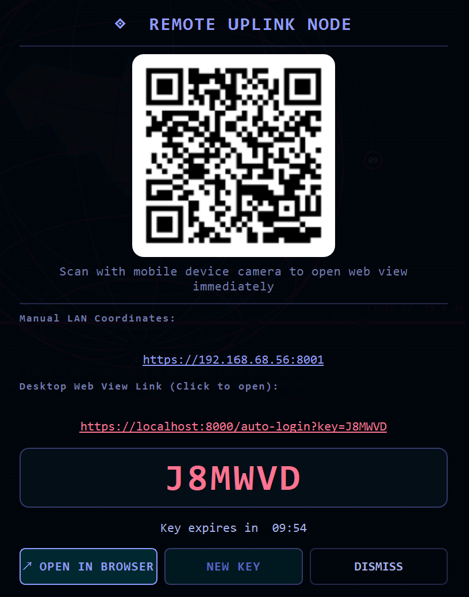
</p>

* **🔐 Encrypted Web Remote (AES-256-CBC)**: Scan the on-screen QR from the desktop or browse locally over WiFi. Session keys encrypted locally with zero external server dependencies.
* **📱 iPhone 16 Viewport Architecture**: High-density responsive layout with collapsible telemetry cards and zero button overflow.
* **📸 Dual-Destination Screenshots**: Automatically dispatches high-res PNG captures to:
  1. **Desktop**: `~/Desktop/alfred_screenshot_<timestamp>.png`
  2. **Phone Feed**: Real-time transmission with **inline thumbnail preview** and single-tap **View / Save Image** link.
* **🎨 ANSI Red Telemetry**: Clean high-contrast machine-readable brackets: `[phone]`, `[control]`, `[screen]`, `[camera]`, `[out]`, `[warn]`, `[error]`, `[mic]`, `[speaker]`, `[listen]`, `[link]`, `[online]`, `[halt]`, `[brief]`, `[monitor]`, `[proactive]`.

---

<a id="desktop-automation"></a>
## 🖥️ 15. Full Desktop Control & OS Automation

* **⌨️ Deep OS Automation**: Keystrokes, mouse positioning, clicks, drags, window focus, clipboard R/W, AI-driven element location (`screen_find`).
* **⏰ OS-Native Scheduling**: Reminders via Windows Task Scheduler (`schtasks`), macOS `launchd`, or Linux `systemd`/`at`.
* **🚀 Enterprise Windows Autostart**: Robust registry management for `ALFRED_AI` with backward-compatible legacy cleanup.
* **🌐 Persistent Browser Profiles**: Multi-tier profile automation (`~/.alfred_profiles`) preventing session dropouts.

---

<a id="memory-briefing"></a>
## 🧠 16. Memory & Briefing Customizer

<p align="center">
  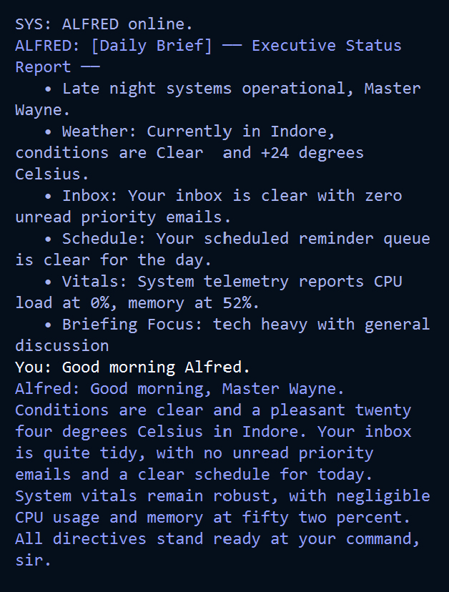
</p>

* **⚡ O(N log N) Pruning Engine**: Memory trimming optimized from O(N²) → O(N log N) using single-pass size accumulators. **50,000 records trimmed in 0.33 seconds**.
* **📚 Tiered Memory Hierarchy** (`memory/long_term.json`): Core identity facts stay in context; extended history recalled on demand via sub-millisecond local keyword search.
* **📰 Conversational Briefing Customizer** (`update_daily_briefing.py`): Saying *"update my daily briefing"* opens an interactive alignment protocol capturing topics, sources, or location shifts to permanent memory.

---

<a id="chassis-themes"></a>
## 🎨 17. Insignia & Chassis Hot-Swapper

<p align="center">
  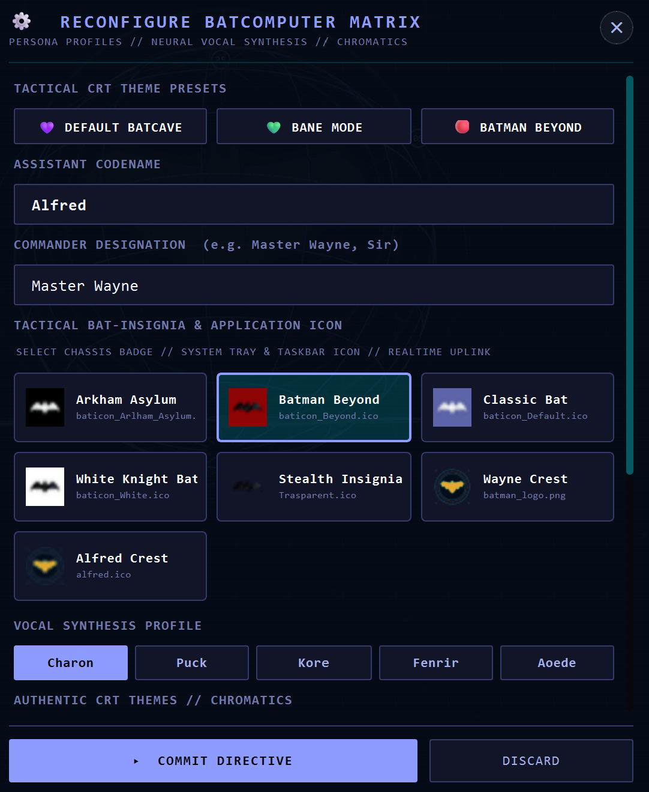
</p>

### 🖼️ Tactical Chassis Themes Showcase

| **Wayne Classic (Default)** | **Batman Beyond** | **Arkham Asylum** |
|:---:|:---:|:---:|
|  | 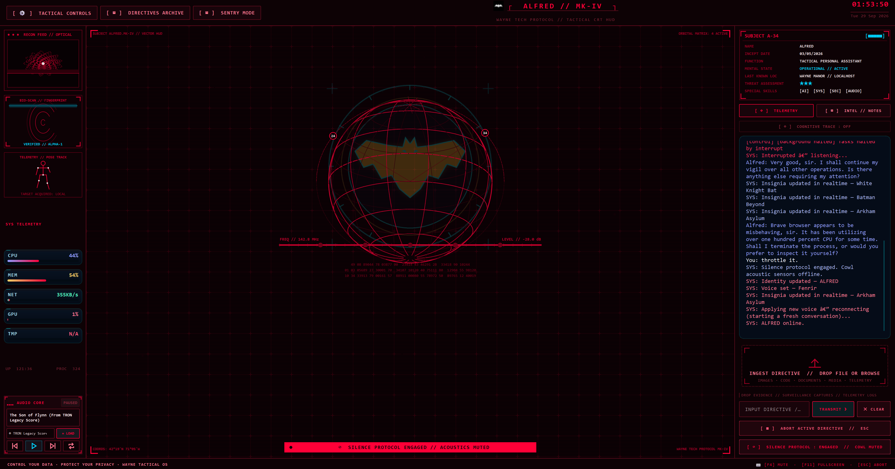 | 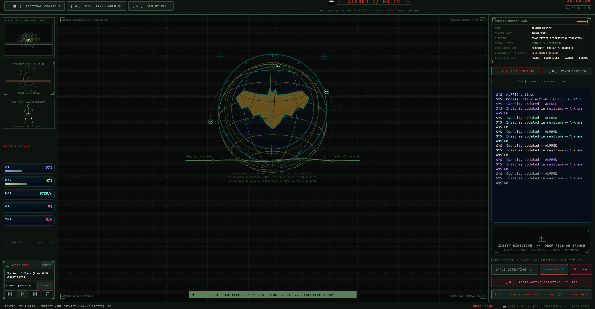 |

| **Bane Protocol** | **The Joker (Anarchy)** | **The Riddler (Enigma)** |
|:---:|:---:|:---:|
| 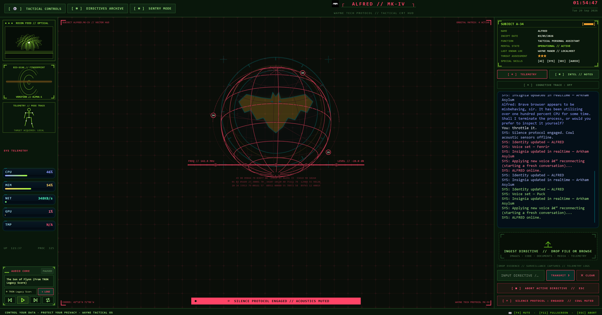 |  | 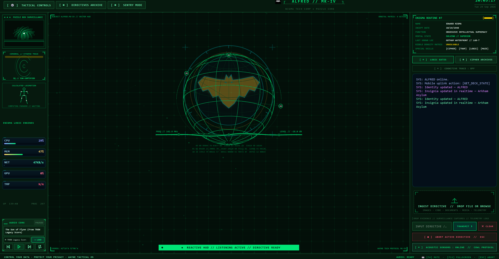 |

| **Two-Face (Dual Chromatic)** | **Catwoman (Tactical)** | **Mr. Freeze (Cryogenic)** |
|:---:|:---:|:---:|
| 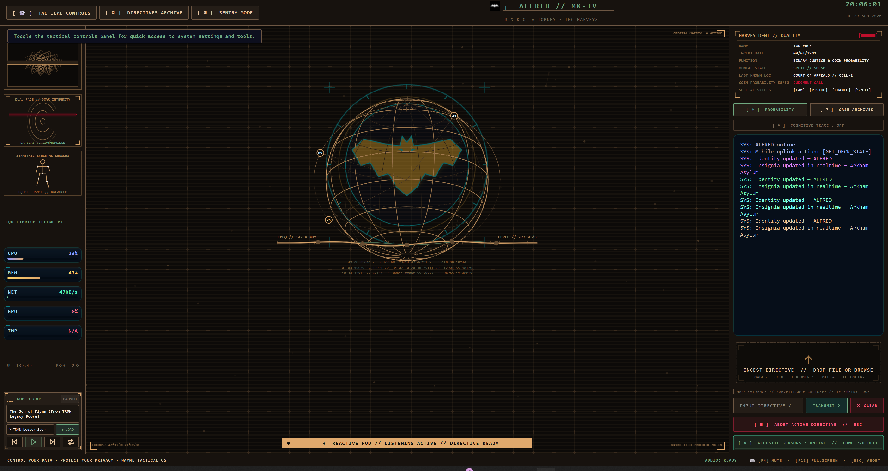 | 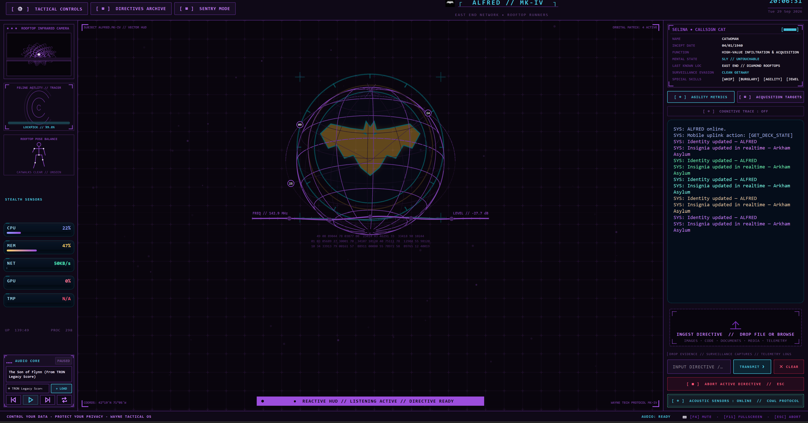 | 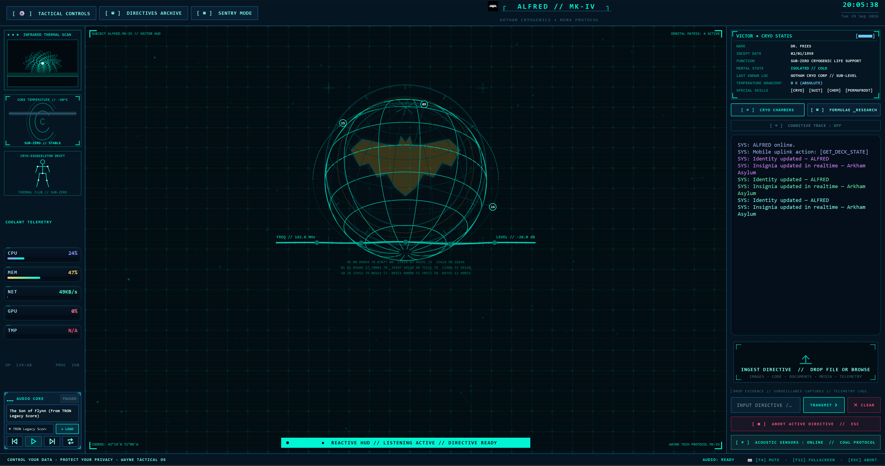 |

| **Justice League Watchtower (Orbital)** |
|:---:|
| 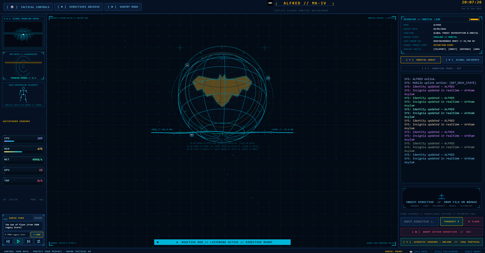 |

* **🎭 Multi-Insignia Catalog**: Scans and registers assets from `Icons/` (Batman Beyond, Arkham Asylum, Classic Bat, White Bat, Tactical Stealth).
* **⚡ Live Runtime Reconfiguration** (`update_app_icon.py`): Hot-swaps window icon, Windows taskbar, and system tray via voice (*"update the app icon to Batman Beyond"*).
* **🔗 Automatic Shortcut Sync**: Dynamically updates `A.L.F.R.E.D.lnk` on Desktop without interrupting the session.

---

<a id="protocol-engine"></a>
## ⚡ 18. Protocol Engine & Macro Playbooks

ALFRED features an autonomous **Protocol Engine** (`actions/protocol_engine.py`) for executing complex sequential compound workflows via custom voice triggers:

* **🎯 Voice Trigger Activation**: Activate multi-app workflows via custom trigger words.
  * *Saying **"FCC CLAUDE"** immediately opens PowerShell as Administrator, launches `fcc-server`, waits for init, opens a second terminal, and executes `fcc-claude`.*
* **🛠️ Interactive Workflow Creation**: *"Let's create a workflow"* enters formulation mode with cryptographic confirmation gate before writing to `config/protocols.yaml`.
* **🔧 Dynamic Variable Interpolation**: `{timestamp}`, `{date}`, `{time}`, `{user}`, `{workspace}`, custom voice args.
* **⏱️ Execution Pacing**: Per-step `sleep_ms` control (e.g., letting servers bind ports before client launches).
* **🛡️ Path Guard Validation**: Every step argument validated through `core.path_guard`. Violations abort remaining steps:
  ```text
  [error] Protocol <Name> halted at Step <X>: <reason>
  ```
* **📊 Red-Tag Telemetry**: `[control] Executing Protocol <Name> Step <X>/<Y>: <Tool_Name>`

---

<a id="visual-grounding"></a>
## 👁️ 19. Local Hybrid Visual Grounding

Streaming full screenshots to cloud APIs for coordinate lookup wastes tokens and latency. ALFRED resolves this via multi-tiered local grounding (`actions/screen_find.py`):

1. **🚀 Local RapidOCR Detection (<150 ms)**: Scans captures locally via `rapidocr_onnxruntime` with toolbar strip partitioning. Identifies buttons and labels in **~75–95 ms**.
2. **🧠 Quantized ONNX Vision Detector**: For icons/glyphs, runs cached quantized ONNX (`omniparser_v2_quant.onnx` / `florence2_quant.onnx`) with zero cold-start.
3. **🎯 Automatic Delegation Threshold**:
   * **Confidence ≥ 0.80**: Returns normalized `(x, y)` immediately.
   * **Confidence < 0.80**: Falls back to Gemini with telemetry:
     ```text
     [screen] Local grounding confidence low (<score>) — delegating to Gemini
     ```

---

<a id="audio-ducking"></a>
## 🔊 20. Audio Ducking & Background Concurrency

* **🎚️ Process-Level Ducking** (`core/audio_ducker.py`): Directly interfaces with OS audio session managers (`pycaw` on Windows, `pulsectl` on Linux). Automatically reduces Spotify, Chrome, YouTube, VLC, Edge by **70%** (factor `0.3`) when ALFRED speaks, restoring exact pre-duck volumes when speech ends or is interrupted.
* **⚙️ Non-Blocking Worker Pool** (`main.py`): Asynchronous `background_task_queue` executing long tasks (web scraping, video processing) concurrently without blocking voice turns. Live `[control] [background XX%]` telemetry.
* **🚦 Bounded Concurrency** (`core/concurrency.py`): Worker pools with controlled limits (default: 5) preventing socket exhaustion.
* **💾 Centralized Cache** (`core/cache.py`): Thread-safe TTL/LRU with deterministic hashing, prefix invalidation, graceful fail-open resilience.

---

<a id="process-watchdog"></a>
## 🚨 21. Process Watchdog & Anomaly Detection

ALFRED incorporates an OS security & performance watchdog daemon actively monitoring processes, flagging anomalies, inspecting sockets, and auto-throttling (`actions/system_monitor.py`):

* **👀 Active Process Tree Monitoring** (`watch_process_tree`): Continuously monitors via `psutil`. Identifies non-system processes sustaining **>90% CPU for >10 consecutive seconds**.
* **🚨 Alert Telemetry**:
  ```text
  [monitor] Resource anomaly: Process <PID:Name> utilizing <X>% CPU
  ```
* **🌐 Suspicious Socket Inspection** (`track_suspicious_sockets`): Tracks outbound TCP/UDP on non-standard ports. Filters RFC private subnets and standard services. Alerts on unexpected egress:
  ```text
  [monitor] Suspicious socket: Process <PID:Name> -> <Remote_IP>:<Port>
  ```
* **⚙️ Automated Throttling** (`throttle_process`):
  * Lowers priority to `psutil.BELOW_NORMAL_PRIORITY_CLASS` (or nice 10 on Unix).
  * Supports `process.suspend()` and `resume_process()`.
* **🛡️ Protected Shields**:
  * **Core System**: `csrss.exe`, `explorer.exe`, `lsass.exe`, `services.exe`, `systemd`, `launchd`.
  * **Developer Tools**: `code.exe`, `cl.exe`, `gcc.exe`, `g++.exe`, `rustc.exe`, `python.exe`, `py.exe`.
  * **ALFRED Hierarchy**: Own PID and all child workers permanently shielded.
* **🔴 Confirmation-Gated Termination** (`terminate_process`): Processes are **never terminated automatically**. All requests dispatched through cryptographic UI confirmation gate (`core/confirm.py`).

---

<a id="system-architecture"></a>
## 🏗️ 22. System Architecture & File Structure

```
ALFRED-MK-VIII/
├── main.py                     # Main loop, Live WebSocket / Local LLM router, audio, tool dispatcher
├── ui.py                       # PyQt6 HUD, audio visualizer, drawer settings
├── ui_overlay.py               # Minimalist floating HUD widget
├── setup.py                    # OS-aware dependency installer
├── core/
│   ├── sentry/                       # Sentry Mode v2
│   │   ├── mode_manager.py           # Singleton coordinating MONITOR + FOCUS
│   │   ├── answer_window.py          # 8-second conversational timeout
│   │   └── focus/
│   │       ├── engine.py             # 1 Hz session loop, settle + deferred lock
│   │       ├── reader.py             # Cross-platform window reader, SHA-256 host hashing
│   │       ├── labels.py             # Transient distraction labels
│   │       ├── lines.py              # Escalation tiers, canned speech pools
│   │       ├── ledger.py             # Atomic focus_ledger.json + report card
│   │       ├── card.py               # FloatingFocusCard (170×48 desktop widget)
│   │       ├── state.py              # Whitelisted FocusState (numbers/booleans only)
│   │       └── platform/             # win.py, mac.py, linux.py
│   ├── prompt.txt              # Master persona directives
│   ├── llm_client.py           # Dual-backend LLM connector
│   ├── action_loader.py        # Tool discovery + parameter validation
│   ├── plugin_loader.py        # Plugin discovery & sandboxing
│   ├── audio_ducker.py         # Process-level ducking
│   ├── concurrency.py          # Bounded worker pool
│   ├── cache.py                # Thread-safe TTL/LRU
│   ├── heal_error.py           # Autonomous error recovery
│   ├── viseme.py               # Unicode → mouth shapes
│   ├── echo.py                 # Calibrated AEC guard
│   ├── hotkey.py               # PTT chord interceptor
│   ├── undo.py                 # Reversible action journal
│   ├── confirm.py              # Cryptographic UI gate
│   ├── audio_devices.py        # Host API enumeration
│   ├── path_guard.py           # Path validation + Heavenly Restriction
│   ├── registry.py             # Process-wide service registry (cross-module singletons)
│   ├── wake_word.py            # Offline openwakeword thread
│   ├── audio/                  # Core audio & acoustic gating
│   │   ├── gate.py             # Acoustic gating (GATE_TTS suppression)
│   │   └── wakeword_tiny.py    # Dual-phrase detector with refractory suppression
│   └── hud_video/              # In-HUD video surface package
│       ├── __init__.py
│       ├── controller.py       # State machine: IDLE→RESOLVING→LOADING→PLAYING→PAUSED
│       ├── surface.py          # HudVideoSurface Qt widget (stack slot 2)
│       ├── resolve.py          # Unified resolver: YouTube / direct URL / local file
│       ├── intent.py           # Locus-phrase detection + transport command parser
│       └── backends/
│           ├── __init__.py     # BackendBase (plain class, no ABCMeta — QObject compat)
│           ├── local_url.py    # QMediaPlayer adapter (local + HTTP streams)
│           └── youtube.py      # yt-dlp VP9/H.264 stream extractor (AV1 excluded)
├── actions/                    # Self-describing operational tools
│   ├── audio_core.py           # TRON ambient score
│   ├── spotify_control.py      # Spotify AI Agent
│   ├── protocol_engine.py      # Macro playbook engine
│   ├── screen_find.py          # Local hybrid grounding
│   ├── computer_control.py     # OS automation, keys, mouse, screenshots
│   ├── screen_processor.py     # Multi-monitor + camera capture
│   ├── file_controller.py      # Guarded file ops
│   ├── file_processor.py       # PDF/DOCX/TXT analysis
│   ├── open_app.py             # OS-specific launcher
│   ├── computer_settings.py    # Volume, brightness, WiFi, power
│   ├── web_search.py           # Parallel multi-mode search
│   ├── intel_notes.py          # Mission notes
│   ├── proactive.py            # Context-aware check-ins
│   ├── background_monitor.py   # Daily topic watcher
│   ├── reminder.py             # OS-native scheduler
│   ├── system_monitor.py       # Watchdog + throttling
│   ├── dev_agent.py            # Autonomous code developer
│   ├── code_helper.py          # Code analysis + debug
│   ├── send_message.py         # WhatsApp + Telegram
│   ├── youtube_video.py        # YouTube search
│   ├── update_app_icon.py      # Chassis insignia switcher
│   ├── update_daily_briefing.py# Briefing customizer
│   ├── game_updater.py         # Steam + Epic updater
│   ├── flight_finder.py        # Flight search
│   ├── gmail_manager.py        # Gmail digest
│   ├── weather_report.py       # Meteorological reports
│   ├── clipboard_history.py    # Session ring-buffer
│   ├── network_tools.py        # Speedtest, IP, ping
│   ├── news_brief.py           # RSS/DDG digest, 15-min cache
│   ├── process_manager.py      # CPU hog detection
│   ├── quick_translate.py      # Gemini instant translation
│   ├── window_manager.py       # Win32 window snapping
│   └── hud_video.py            # In-HUD video player (locus gate + transport commands)
├── config/
│   ├── protocols.yaml          # Compound playbooks
│   ├── api_keys.json           # Credentials + settings
│   └── certs/                  # Self-signed SSL
├── models/                     # Acoustic wake word & quantized vision models
│   ├── alfred.onnx             # Custom fine-tuned OpenWakeWord acoustic model
│   ├── alfred.onnx.original    # Factory baseline model backup
│   ├── alfred_verifier.pkl     # Biometric personal voice verifier (optional)
│   └── omniparser_v2_quant.onnx
├── tools/                      # Training, testing & diagnostic toolset
│   ├── record_training_samples.py # Multi-speaker voice dataset recorder & packager
│   ├── train_personal_verifier.py # Biometric personal voice verifier trainer
│   ├── test_wake_model.py      # Real-time microphone test & acoustic VU meter
│   ├── train_wakeword.py       # Baseline ONNX integrity verifier & downloader
│   ├── benchmark_latency_pipeline.py # End-to-end pipeline benchmark
│   └── profile_alfred_ui.py    # UI frame timing & rendering profiler
├── train_alfred_colab.ipynb    # Google Colab / Local IDE neural network training notebook
├── plugins/
│   ├── _template.py
│   ├── calendar_sync.py
│   └── focus_protocol.py
├── dashboard/                  # Quantum Mobile Remote
│   ├── server.py               # FastAPI + Uvicorn + WebSocket
│   ├── static/
│   │   ├── app.html            # iPhone 16 responsive app
│   │   └── login.html          # Quantum access gateway
│   └── uploads/
├── memory/
│   ├── memory_manager.py       # O(N log N) persistence
│   ├── config_manager.py       # Settings management
│   ├── graph_manager.py        # Knowledge graph mutation
│   └── long_term.json          # Encrypted fact database
├── tests/                      # Unit + integration + benchmarks
│   └── benchmarks/
└── graphify-out/               # GraphRAG knowledge graph
```

---

<a id="configuration-reference"></a>
## ⚙️ 23. Configuration Reference & Hotkeys

**`config/api_keys.json`:**
```json
{
    "assistant_name": "ALFRED",
    "user_name": "Master Wayne",
    "ui_color": "#e5a93b",
    "voice_name": "Charon",
    "wake_word_enabled": false,
    "push_to_talk_enabled": true,
    "llm_provider": "openrouter",
    "openrouter_api_key": "sk-or-v1-YOUR_OPENROUTER_KEY",
    "openrouter_model": "anthropic/claude-3.5-sonnet",
    "gemini_api_key": "AIzaSyYOUR_GEMINI_KEY",
    "llm_url": "http://localhost:11434",
    "llm_model": "llama3.2",
    "app_icon": "Icons/Classic Bat.png",
    "spotify_client_id": "YOUR_SPOTIFY_CLIENT_ID",
    "spotify_client_secret": "YOUR_SPOTIFY_CLIENT_SECRET",
    "spotify_redirect_uri": "http://127.0.0.1:8888/callback",
    "spotify_refresh_token": "YOUR_SPOTIFY_REFRESH_TOKEN",
    "spotify_market": "from_token"
}
```

### ⌨️ Hotkey Shortcuts

| Shortcut | Action |
|---|---|
| `Ctrl+Space` (Hold) | Global Push-to-Talk |
| `F4` | Instant Mic Mute / Unmute |
| `F11` | Toggle Fullscreen HUD |
| `Escape` | Interrupt speech mid-utterance, re-arm mic |

---

<a id="knowledge-graph"></a>
## 🕸️ 24. Knowledge Graph — Graphify

<p align="center">
  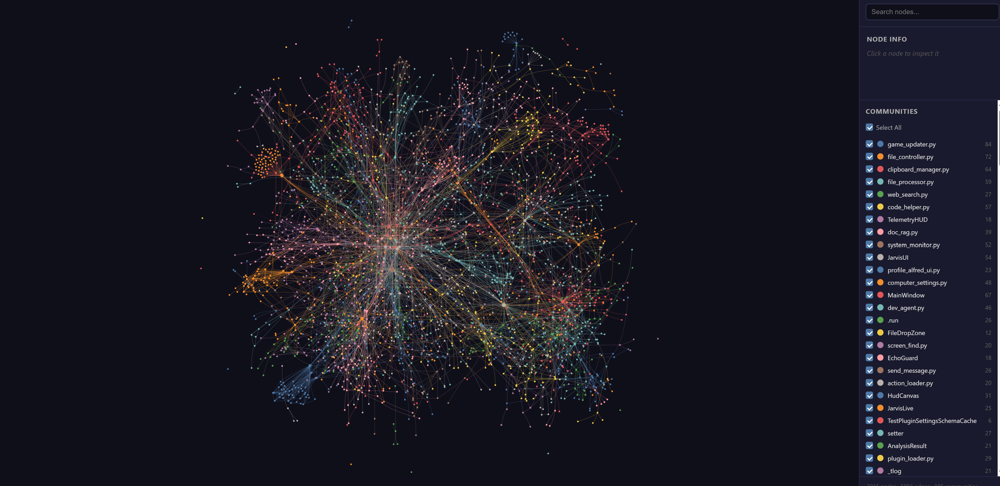
</p>

This codebase is indexed with a persistent **GraphRAG Knowledge Graph** in `graphify-out/`:
* **📊 5,436 nodes** & **11,125 relationships** across **283 semantic communities**.
* **🌐 Interactive Visualization**: [`graphify-out/graph.html`](file:///d:/Projects/Alfred-Mark-VIII/graphify-out/graph.html)
* **📄 Architectural Report**: [`graphify-out/GRAPH_REPORT.md`](file:///d:/Projects/Alfred-Mark-VIII/graphify-out/GRAPH_REPORT.md)
* **⚡ Dynamic Graph Management**: Real-time mutation, entity/relationship addition, exponential decay, 2-hop querying via `memory/graph_manager.py`.

### 🎁 Mark VIII New Actions (Auto-Discovered)

| Action | Purpose |
|---|---|
| `clipboard_history` | Ring-buffer of last 20 copies. *"What did I copy earlier?"* |
| `window_manager` | Snap, tile, fullscreen, minimize by voice. Pure Win32. |
| `quick_translate` | Any language → any language via authenticated Gemini. |
| `network_tools` | Speed test, public/local IP, ping, active connections. |
| `process_manager` | Kill / find / list CPU hogs by name or PID. |
| `news_brief` | On-demand headlines with topic filter. 15-min cache. |
| `hud_video` | In-HUD video player. YouTube, direct URLs, local files. |

### 🎬 In-HUD Video Surface

The avatar slot transforms into a video player on demand — no browser, no floating window.

**Trigger phrases:** say the target *plus* a locus phrase:  
*"in the app" · "in the player" · "in the HUD" · "on screen" · "in the batcomputer"*

```
"Play the new Dune trailer in the app"
"Watch this in the player"        ← clipboard URL used
"Show me the Blender demo on screen"
```

**One shared pipeline for all sources:**
- **YouTube URL or search** — yt-dlp extracts a VP9+Opus CDN stream; `QMediaPlayer` plays it natively, zero browser opened
- **Direct HTTP media URL** — mp4, webm, mkv, m3u8 and more, played immediately
- **Local file path** — path-guard validated, `file://` URI handed to `QMediaPlayer`

**Controls:**
| Voice | Action |
|---|---|
| *"pause"* | Pauses video |
| *"resume"* | Resumes video |
| *"stop video"* / *"close player"* / *"bring back the avatar"* | Stops and restores the globe |
| *"mute"* / *"unmute"* | Audio gate (starts unmuted with volume retention) |
| *"louder"* / *"quieter"* | Volume ±10% |

**Architecture:**
- `HudVideoSurface` lives in slot 2 of the existing `_hud_cam_stack` (`QStackedWidget`) — zero impact on camera and globe slots
- State machine: `IDLE → RESOLVING → LOADING → PLAYING → PAUSED → ERROR → IDLE`
- Synchronized dual-player audio pipeline + Win32 airspace frameless tool overlays
- Speech-before-pixels: TTS ack fires before resolve starts
- Pause on minimise, resume on restore
- Auto-stops after 5 min background (paused)
- Background music ducks when video sound is enabled
- Controller registered via `core/registry.py` — process-wide service dict; eliminates the `__main__` vs `import main` module-identity split that silently voids cross-module references in `python main.py` sessions

**Codec policy:**
yt-dlp format selector explicitly excludes AV1 (`av01`) and prefers VP9+Opus, falling back to H.264+AAC. FFmpeg has full software VP9 decode; no hardware acceleration required. `QT_LOGGING_RULES=qt.multimedia.ffmpeg=false` suppresses FFmpeg hwaccel noise at boot.


### 🔧 Network Resilience & UI Performance
* Windows-specific socket error strings added to reconnect classifier: `wsarecv`, `wsasend`, `stream reading error`, `WinError`, `BrokenPipeError`, `ConnectionResetError`, `ConnectionAbortedError`.
* Serial startup replaced with concurrent execution (`ThreadPoolExecutor`).
* Vector HUD: cached static CRT grid + batched globe wireframe (`drawLines`) for silky 60 FPS.

### 🔩 Infrastructure Fixes
* **`core/registry.py`** — process-wide service dictionary solving the `__main__` vs `import main` Python module-identity split. Any subsystem can `register("key", obj)` / `lookup("key")` across the process boundary without circular imports or ghost-module writes.
* **`BackendBase` metaclass fix** — Qt's `pyqtWrapperType` and Python's `ABCMeta` cannot coexist in a MRO. `BackendBase` is now a plain class with `NotImplementedError` stubs — identical interface contract, zero metaclass conflict.
* **VP9 codec policy** — yt-dlp format selector excludes AV1 (`av01`) system-wide. VP9+Opus is selected first (full FFmpeg software decode, no GPU required), with H.264+AAC as fallback.
* **FFmpeg AV1 noise suppression** — `QT_LOGGING_RULES=qt.multimedia.ffmpeg=false` set at boot in `main.py` before `QApplication` is constructed.

---

<a id="author-licensing"></a>
## 👤 25. Author & Licensing

* **🎩 Lead Architect & Creator:** **ADITYA MANOJ**
* **🦇 Project:** ALFRED-MK-VIII — Version 8 (Stable Build · Windows, Wayne Protocol Edition)
* **📜 License:** [Creative Commons Attribution-NonCommercial 4.0 International (CC BY-NC 4.0)](https://creativecommons.org/licenses/by-nc/4.0/)

<p align="center">
  <a href="https://buymeacoffee.com/adityamanoj" target="_blank">
    
  </a>
</p>

---

*⚡ Built with precision for autonomy, performance, and complete digital sovereignty — the most function-dense, optimisation-conscious open tactical assistant in the Wayne-protocol class.*
